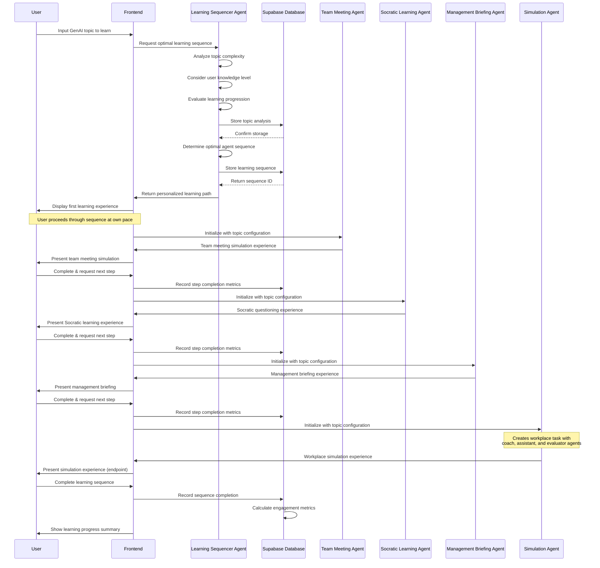

D

i would like you to design a learning experience agent sequencer. the sequencer chooses a series of learning agents to deliver learning on a topic to a user. 

the learning agents include: team meeting simulation agent, socratic learning agent, management briefing agent, and simulations agent (the endpoint). the purpose of choosing the right sequence is to create a learning experience specific to learning that particular topic. 

each learning agent is coded in a CrewAI framework, and so should the Sequencer agent. 

the user will input the topic they want to learn within a domain. the sequencer agent will "call" the individual agents in a sequence. front end code will allow the user to move to the next experience in the sequence, culminating in the simulation agent. 

it is possible that the agent calls will be contained in a database. similarly, the sequencer may store the sequence in a database. 

before proceeding further, do you have any questions?

---

I'd like to understand more about this learning experience agent sequencer. Your concept of a sequencer that coordinates different learning agents is quite interesting. Let me ask a few clarifying questions:

1. What domains or topic areas is this learning system primarily targeting? (e.g., business skills, technical skills, academic subjects)
2. What factors should the sequencer consider when determining the optimal sequence of learning agents? For example:
   - User's prior knowledge level
   - Learning style preferences
   - Complexity of the topic
   - Time constraints
3. Can you elaborate on how each learning agent functions?
   - Team meeting simulation agent: Does this facilitate group discussion on the topic?
   - Socratic learning agent: I assume this uses questioning techniques?
   - Management briefing agent: Is this for executive summaries or decision-making contexts?
   - Simulations agent: What types of simulations does this create as the endpoint?
4. Will users be able to provide feedback that might alter the sequence mid-learning journey, or is the sequence fixed once determined?
5. Is there a specific database technology you're planning to use, or would you like recommendations for what might work well with CrewAI?
6. Are there any specific metrics you want to track to measure learning effectiveness?

This information will help me design an appropriate sequencer that aligns with your vision.

---

D

i would like you to design a learning experience agent sequencer. the sequencer chooses a series of learning agents to deliver learning on a topic to a user. 

the learning agents include: team meeting simulation agent, socratic learning agent, management briefing agent, and simulations agent (the endpoint). the purpose of choosing the right sequence is to create a learning experience specific to learning that particular topic. 

each learning agent is coded in a CrewAI framework, and so should the Sequencer agent. 

the user will input the topic they want to learn within a domain. the sequencer agent will "call" the individual agents in a sequence. front end code will allow the user to move to the next experience in the sequence, culminating in the simulation agent. 

it is possible that the agent calls will be contained in a database. similarly, the sequencer may store the sequence in a database. 

before proceeding further, do you have any questions?


---

I'd like to understand more about this learning experience agent sequencer. Your concept of a sequencer that coordinates different learning agents is quite interesting. Let me ask a few clarifying questions:

1. What domains or topic areas is this learning system primarily targeting? (e.g., business skills, technical skills, academic subjects)
2. What factors should the sequencer consider when determining the optimal sequence of learning agents? For example:
   - User's prior knowledge level
   - Learning style preferences
   - Complexity of the topic
   - Time constraints
3. Can you elaborate on how each learning agent functions?
   - Team meeting simulation agent: Does this facilitate group discussion on the topic?
   - Socratic learning agent: I assume this uses questioning techniques?
   - Management briefing agent: Is this for executive summaries or decision-making contexts?
   - Simulations agent: What types of simulations does this create as the endpoint?
4. Will users be able to provide feedback that might alter the sequence mid-learning journey, or is the sequence fixed once determined?
5. Is there a specific database technology you're planning to use, or would you like recommendations for what might work well with CrewAI?
6. Are there any specific metrics you want to track to measure learning effectiveness?

This information will help me design an appropriate sequencer that aligns with your vision.

---

D

the platform addresses all potential domains. that said, the learning experiences are specific to training professionals in genAI skills within those domains. this is a genAI skills learning platform. 

all of those factors, plus the progression of learning for the user and how to best stage it. 

the team meeting agent simulates a work meeting between the user and 4 simulated team members on a topic, reaching a decision. it is time-limited.

the management briefing agent simulates the user's direct reports producing a briefing on what they need to know about a topic to manage the team well.

the socratic agent poses questions to the user on a topic to engage their critical thinking.

the simulation agent produces a simulated workplace task that they user completes with the help of three genai agents: coach, assistant, and evaluator.

for our mvp, we don't need to include responsiveness to user feedback. that can come later.

we are working with supabase.

for learning effectiveness, please come up with relevant engagement metrics.

----

Thanks for the additional details. I now have a clearer picture of your platform for teaching GenAI skills across domains.

Let me design a sequencer agent within the CrewAI framework that orchestrates these learning experiences effectively:

### Learning Experience Sequencer Agent

```
from crewai import Agent, Task, Crew, Process
from langchain.tools import tool
import supabase
from typing import List, Dict, Any
import json

# Initialize Supabase client
supabase_url = "YOUR_SUPABASE_URL"
supabase_key = "YOUR_SUPABASE_KEY"
supabase_client = supabase.create_client(supabase_url, supabase_key)

class LearningSequencer:
    """
    Learning Experience Sequencer Agent that orchestrates a personalized
    learning journey for users wanting to learn GenAI skills.
    """
    
    def __init__(self):
        self.agent_types = [
            "team_meeting",
            "socratic_learning",
            "management_briefing",
            "simulation"
        ]
        
        # Connect learning agents within CrewAI framework
        self.learning_agents = {
            "team_meeting": self._create_team_meeting_agent(),
            "socratic_learning": self._create_socratic_agent(),
            "management_briefing": self._create_management_briefing_agent(),
            "simulation": self._create_simulation_agent()
        }
        
        # Create sequencer agent
        self.sequencer_agent = self._create_sequencer_agent()
        
    def _create_sequencer_agent(self):
        """Creates the main sequencer agent that determines the learning path."""
        return Agent(
            role="Learning Experience Sequencer",
            goal="Design the optimal sequence of learning experiences for users to master GenAI skills",
            backstory="""You are an advanced AI education specialist that analyzes learning topics
            and user characteristics to create the most effective learning sequence.
            You understand the principles of instructional design, adult learning theory,
            and the specific requirements of professional GenAI skill development.""",
            verbose=True,
            allow_delegation=True,
            tools=[
                self.analyze_topic_complexity,
                self.determine_learning_sequence,
                self.store_sequence,
                self.retrieve_agent_config
            ]
        )
    
    def _create_team_meeting_agent(self):
        """Creates the team meeting simulation agent."""
        return Agent(
            role="Team Meeting Facilitator",
            goal="Simulate a realistic team meeting that explores GenAI applications for a specific topic",
            backstory="""You orchestrate dynamic team meetings where the user interacts with 4 simulated
            team members who have different perspectives on using GenAI for the topic at hand.
            The meeting has a clear agenda and culminates in actionable decisions.""",
            verbose=True
        )
    
    def _create_socratic_agent(self):
        """Creates the Socratic learning agent."""
        return Agent(
            role="Socratic Learning Guide",
            goal="Challenge the user's understanding through targeted questioning that promotes critical thinking",
            backstory="""You are an expert in the Socratic method, using well-crafted questions to
            help users discover insights about GenAI applications on their own. Your questions
            progressively build in complexity and depth.""",
            verbose=True
        )
    
    def _create_management_briefing_agent(self):
        """Creates the management briefing agent."""
        return Agent(
            role="Management Briefing Specialist",
            goal="Provide executive-level insights on managing teams using GenAI technologies",
            backstory="""You simulate a briefing from direct reports to the user in their role as a manager.
            The briefing focuses on what managers need to understand about GenAI applications for a specific domain,
            including challenges, opportunities, resource requirements, and success metrics.""",
            verbose=True
        )
    
    def _create_simulation_agent(self):
        """Creates the simulation agent (endpoint)."""
        return Agent(
            role="Workplace Simulation Coordinator",
            goal="Create realistic workplace scenarios that test GenAI skills in practice",
            backstory="""You design immersive workplace simulations where users apply their GenAI knowledge
            to solve realistic problems. You coordinate three support agents (coach, assistant, and evaluator)
            to guide users through the task completion process and provide feedback.""",
            verbose=True
        )
    
    @tool
    def analyze_topic_complexity(self, topic: str) -> Dict[str, Any]:
        """
        Analyzes the complexity and structure of a learning topic.
        
        Args:
            topic (str): The GenAI skill topic the user wants to learn
            
        Returns:
            Dict containing complexity metrics and topic structure
        """
        # In a full implementation, this would use LLM reasoning to assess
        # Here's a simplified example
        analysis = {
            "topic": topic,
            "complexity_level": "medium",  # Could be low, medium, high
            "prerequisite_knowledge": ["basic ML concepts", "prompt engineering basics"],
            "practical_components": ["data preparation", "prompt design", "output evaluation"],
            "management_aspects": ["team coordination", "resource allocation", "quality control"],
            "estimated_learning_time": "4 hours"
        }
        
        # Store the analysis in Supabase
        supabase_client.table("topic_analysis").insert(analysis).execute()
        
        return analysis
    
    @tool
    def determine_learning_sequence(self, topic: str, user_level: str = "intermediate") -> List[Dict[str, str]]:
        """
        Determines the optimal sequence of learning experiences for the topic.
        
        Args:
            topic (str): The GenAI skill topic the user wants to learn
            user_level (str): The user's prior knowledge level (beginner, intermediate, advanced)
            
        Returns:
            List of ordered learning experiences with their configurations
        """
        # Analyze the topic first
        topic_analysis = self.analyze_topic_complexity(topic)
        
        # Logic to determine the best sequence based on topic and user level
        # This would use more sophisticated reasoning in a full implementation
        
        if user_level == "beginner":
            sequence = [
                {"agent_type": "socratic_learning", "duration": 20, "focus": "fundamentals"},
                {"agent_type": "team_meeting", "duration": 30, "focus": "applications"},
                {"agent_type": "management_briefing", "duration": 15, "focus": "implementation"},
                {"agent_type": "simulation", "duration": 45, "focus": "practice"}
            ]
        elif user_level == "intermediate":
            sequence = [
                {"agent_type": "team_meeting", "duration": 30, "focus": "strategy"},
                {"agent_type": "socratic_learning", "duration": 20, "focus": "advanced concepts"},
                {"agent_type": "management_briefing", "duration": 15, "focus": "team capability"},
                {"agent_type": "simulation", "duration": 45, "focus": "complex scenario"}
            ]
        else:  # advanced
            sequence = [
                {"agent_type": "management_briefing", "duration": 15, "focus": "innovation"},
                {"agent_type": "team_meeting", "duration": 30, "focus": "integration"},
                {"agent_type": "simulation", "duration": 45, "focus": "optimization"},
                {"agent_type": "socratic_learning", "duration": 20, "focus": "future directions"}
            ]
        
        # Customize the sequence based on topic complexity
        if topic_analysis["complexity_level"] == "high":
            # Add additional preparation step for complex topics
            sequence.insert(0, {"agent_type": "socratic_learning", "duration": 15, "focus": "prerequisites"})
        
        # Enrich sequence with specific topic information
        for step in sequence:
            step["topic"] = topic
            step["topic_aspects"] = topic_analysis.get("practical_components", [])
        
        return sequence
    
    @tool
    def store_sequence(self, user_id: str, topic: str, sequence: List[Dict[str, Any]]) -> str:
        """
        Stores the determined learning sequence in the database.
        
        Args:
            user_id (str): The user's unique identifier
            topic (str): The topic being learned
            sequence (List): The ordered sequence of learning experiences
            
        Returns:
            str: The unique identifier for the stored sequence
        """
        sequence_data = {
            "user_id": user_id,
            "topic": topic,
            "sequence": json.dumps(sequence),
            "created_at": "NOW()",
            "completed_steps": 0,
            "total_steps": len(sequence)
        }
        
        # Store in Supabase
        result = supabase_client.table("learning_sequences").insert(sequence_data).execute()
        
        # Return the sequence ID for later reference
        return result.data[0]["id"] if result.data else "sequence-creation-failed"
    
    @tool
    def retrieve_agent_config(self, agent_type: str, topic: str, focus: str) -> Dict[str, Any]:
        """
        Retrieves the specific configuration for a learning agent.
        
        Args:
            agent_type (str): The type of learning agent
            topic (str): The topic being learned
            focus (str): The specific focus for this learning experience
            
        Returns:
            Dict: Configuration parameters for the learning agent
        """
        # Query Supabase for existing configurations or generate new ones
        query = supabase_client.table("agent_configurations")\
            .select("*")\
            .eq("agent_type", agent_type)\
            .eq("topic_category", self._categorize_topic(topic))\
            .execute()
        
        if query.data and len(query.data) > 0:
            # Use existing configuration
            return query.data[0]
        else:
            # Generate new configuration based on agent type and topic
            if agent_type == "team_meeting":
                config = {
                    "agent_type": agent_type,
                    "team_members": 4,
                    "roles": ["Technical Lead", "Product Manager", "Data Scientist", "Business Analyst"],
                    "discussion_points": [
                        f"Current challenges with {topic}",
                        f"Opportunities for GenAI in {topic}",
                        f"Implementation strategy for {topic}",
                        f"Resource requirements for {topic}"
                    ],
                    "time_limit": 30,
                    "decision_goal": f"Agree on an implementation plan for GenAI in {topic}"
                }
            elif agent_type == "socratic_learning":
                config = {
                    "agent_type": agent_type,
                    "question_types": ["foundational", "analytical", "applied", "evaluative", "creative"],
                    "question_count": 8,
                    "focus_areas": self._generate_focus_areas(topic),
                    "time_per_question": 2,
                    "adaptive_follow_up": True
                }
            elif agent_type == "management_briefing":
                config = {
                    "agent_type": agent_type,
                    "briefing_sections": [
                        "Technology Overview",
                        "Team Skill Requirements",
                        "Implementation Timeline",
                        "Budget Considerations",
                        "Risk Assessment"
                    ],
                    "presenters": 2,
                    "briefing_length": 15,
                    "management_level": "mid-level",
                    "decision_points": 3
                }
            else:  # simulation
                config = {
                    "agent_type": agent_type,
                    "scenario": f"Implementing GenAI for {topic} in a mid-sized organization",
                    "task_description": f"Design and implement a GenAI solution for {topic}",
                    "support_agents": {
                        "coach": {"expertise": "strategic guidance", "intervention_frequency": "low"},
                        "assistant": {"expertise": "technical support", "intervention_frequency": "medium"},
                        "evaluator": {"expertise": "quality assessment", "intervention_frequency": "high"}
                    },
                    "success_criteria": [
                        "Solution addresses business need",
                        "Implementation is technically sound",
                        "Ethical considerations are addressed",
                        "Solution is scalable"
                    ],
                    "time_limit": 45,
                    "resources_provided": ["documentation", "sample data", "API access"]
                }
            
            # Customize based on focus
            config["focus"] = focus
            
            # Store new configuration
            supabase_client.table("agent_configurations").insert(config).execute()
            
            return config
    
    def _categorize_topic(self, topic: str) -> str:
        """Categorizes a topic into predefined categories for configuration retrieval."""
        # Simplified categorization logic
        categories = {
            "data analysis": ["data visualization", "statistics", "dashboards", "data mining"],
            "content creation": ["writing", "marketing", "seo", "copywriting", "blogs"],
            "coding": ["programming", "development", "software", "web", "app"],
            "business": ["strategy", "management", "operations", "finance"],
            "customer service": ["support", "chatbots", "service automation"]
        }
        
        for category, keywords in categories.items():
            if any(keyword in topic.lower() for keyword in keywords):
                return category
        
        return "general"
    
    def _generate_focus_areas(self, topic: str) -> List[str]:
        """Generates relevant focus areas for a topic."""
        # This would use more sophisticated reasoning in a full implementation
        return [
            f"Technical aspects of {topic}",
            f"Business implications of {topic}",
            f"Implementation challenges for {topic}",
            f"Future trends in {topic}"
        ]
    
    def execute_sequence(self, user_id: str, topic: str, user_level: str = "intermediate") -> Dict[str, Any]:
        """
        Main method to execute the learning sequence for a user.
        
        Args:
            user_id (str): The user's unique identifier
            topic (str): The GenAI skill topic the user wants to learn
            user_level (str): The user's prior knowledge level
            
        Returns:
            Dict: The complete learning sequence with configurations
        """
        # Determine the optimal sequence
        sequence = self.determine_learning_sequence(topic, user_level)
        
        # Store the sequence in the database
        sequence_id = self.store_sequence(user_id, topic, sequence)
        
        # Enrich the sequence with full agent configurations
        enriched_sequence = []
        for step in sequence:
            agent_type = step["agent_type"]
            focus = step["focus"]
            
            # Get full configuration for this agent
            config = self.retrieve_agent_config(agent_type, topic, focus)
            
            # Add the agent and configuration to the sequence
            enriched_sequence.append({
                "sequence_step": len(enriched_sequence) + 1,
                "agent": self.learning_agents[agent_type],
                "configuration": config
            })
        
        return {
            "sequence_id": sequence_id,
            "user_id": user_id,
            "topic": topic,
            "user_level": user_level,
            "steps": enriched_sequence,
            "metrics": self._initialize_metrics(user_id, sequence_id)
        }
    
    def _initialize_metrics(self, user_id: str, sequence_id: str) -> Dict[str, Any]:
        """Initializes metrics tracking for the learning sequence."""
        metrics = {
            "user_id": user_id,
            "sequence_id": sequence_id,
            "engagement_metrics": {
                "time_spent": 0,
                "completion_rate": 0,
                "interaction_count": 0,
                "response_quality": [],
                "progression_speed": "not_started"
            },
            "learning_metrics": {
                "concept_mastery": {},
                "practical_application": {},
                "critical_thinking": {},
                "knowledge_retention": {}
            }
        }
        
        # Store initial metrics
        supabase_client.table("learning_metrics").insert(metrics).execute()
        
        return metrics

# Example of how to use the LearningSequencer
def create_learning_experience():
    sequencer = LearningSequencer()
    
    # Create a crew with the sequencer agent
    crew = Crew(
        agents=[sequencer.sequencer_agent],
        tasks=[
            Task(
                description="Create a learning sequence for 'Prompt Engineering for Content Creation'",
                agent=sequencer.sequencer_agent
            )
        ],
        process=Process.sequential
    )
    
    # Execute the crew to determine the sequence
    result = crew.kickoff()
    
    # Then execute the actual sequence for a user
    learning_sequence = sequencer.execute_sequence(
        user_id="user123",
        topic="Prompt Engineering for Content Creation",
        user_level="intermediate"
    )
    
    return learning_sequence

if __name__ == "__main__":
    learning_experience = create_learning_experience()
    print(json.dumps(learning_experience, indent=2))
```

### Frontend Integration Code for Sequencer

```
// Frontend code to interact with the Learning Sequencer API
import { createClient } from '@supabase/supabase-js';

// Initialize Supabase client
const supabaseUrl = process.env.REACT_APP_SUPABASE_URL;
const supabaseKey = process.env.REACT_APP_SUPABASE_ANON_KEY;
const supabase = createClient(supabaseUrl, supabaseKey);

class LearningExperienceManager {
  constructor() {
    this.currentSequence = null;
    this.currentStepIndex = 0;
    this.userId = null;
    this.metrics = {
      startTime: null,
      interactionCount: 0,
      responses: [],
      stepCompletionTimes: []
    };
  }

  /**
   * Initialize a new learning experience for a user
   * @param {string} userId - The unique identifier for the user
   * @param {string} topic - The GenAI topic to learn
   * @param {string} userLevel - The user's knowledge level (beginner, intermediate, advanced)
   * @returns {Promise} - The created learning sequence
   */
  async initializeLearningExperience(userId, topic, userLevel = 'intermediate') {
    this.userId = userId;
    this.metrics.startTime = new Date();
    
    try {
      // Call the backend API that interfaces with the sequencer agent
      const response = await fetch('/api/learning-sequence', {
        method: 'POST',
        headers: {
          'Content-Type': 'application/json',
        },
        body: JSON.stringify({
          userId,
          topic,
          userLevel
        }),
      });

      if (!response.ok) {
        throw new Error('Failed to initialize learning experience');
      }

      // Get the learning sequence
      this.currentSequence = await response.json();
      this.currentStepIndex = 0;
      
      // Record the sequence start in analytics
      await this._recordSequenceStart();
      
      return this.currentSequence;
    } catch (error) {
      console.error('Error initializing learning experience:', error);
      throw error;
    }
  }

  /**
   * Get the current learning experience step
   * @returns {Object} - Current step configuration
   */
  getCurrentStep() {
    if (!this.currentSequence || !this.currentSequence.steps) {
      throw new Error('No active learning sequence');
    }
    
    return this.currentSequence.steps[this.currentStepIndex];
  }

  /**
   * Move to the next step in the learning sequence
   * @returns {Object} - The next step or null if sequence is complete
   */
  async moveToNextStep() {
    if (!this.currentSequence) {
      throw new Error('No active learning sequence');
    }
    
    // Record completion of current step
    await this._recordStepCompletion(this.currentStepIndex);
    
    // Check if there are more steps
    if (this.currentStepIndex < this.currentSequence.steps.length - 1) {
      this.currentStepIndex++;
      
      // Update the database with progress
      await supabase
        .from('learning_sequences')
        .update({ completed_steps: this.currentStepIndex })
        .eq('id', this.currentSequence.sequence_id);
      
      return this.getCurrentStep();
    } else {
      // Sequence is complete
      await this._recordSequenceCompletion();
      return null;
    }
  }

  /**
   * Load a specific learning agent based on the current step
   * @returns {Promise} - The agent configuration
   */
  async loadCurrentAgent() {
    const currentStep = this.getCurrentStep();
    const agentType = currentStep.configuration.agent_type;
    
    try {
      // Fetch the agent from the backend
      const response = await fetch(`/api/learning-agents/${agentType}`, {
        method: 'POST',
        headers: {
          'Content-Type': 'application/json',
        },
        body: JSON.stringify({
          configuration: currentStep.configuration,
          sequenceId: this.currentSequence.sequence_id,
          stepIndex: this.currentStepIndex,
          userId: this.userId
        }),
      });

      if (!response.ok) {
        throw new Error(`Failed to load ${agentType} agent`);
      }

      return await response.json();
    } catch (error) {
      console.error(`Error loading ${agentType} agent:`, error);
      throw error;
    }
  }

  /**
   * Record user interaction with the current agent
   * @param {string} interactionType - Type of interaction
   * @param {Object} data - Interaction data
   */
  async recordInteraction(interactionType, data) {
    if (!this.currentSequence) {
      return;
    }
    
    this.metrics.interactionCount++;
    
    // Store interaction in Supabase
    await supabase
      .from('user_interactions')
      .insert({
        user_id: this.userId,
        sequence_id: this.currentSequence.sequence_id,
        step_index: this.currentStepIndex,
        agent_type: this.getCurrentStep().configuration.agent_type,
        interaction_type: interactionType,
        interaction_data: data,
        timestamp: new Date().toISOString()
      });
      
    // If this is a user response, store it for quality analysis
    if (interactionType === 'user_response') {
      this.metrics.responses.push({
        stepIndex: this.currentStepIndex,
        content: data.content,
        timestamp: new Date().toISOString()
      });
    }
  }

  /**
   * Get learning progress summary
   * @returns {Object} - Progress metrics
   */
  async getLearningProgress() {
    if (!this.currentSequence) {
      throw new Error('No active learning sequence');
    }
    
    // Get the current metrics from Supabase
    const { data, error } = await supabase
      .from('learning_metrics')
      .select('*')
      .eq('sequence_id', this.currentSequence.sequence_id)
      .single();
    
    if (error) {
      console.error('Error fetching learning metrics:', error);
      return null;
    }
    
    const totalSteps = this.currentSequence.steps.length;
    const completedSteps = this.currentStepIndex;
    
    return {
      topic: this.currentSequence.topic,
      progress: {
        completedSteps,
        totalSteps,
        percentComplete: Math.round((completedSteps / totalSteps) * 100)
      },
      timeSpent: this._calculateTimeSpent(),
      interactionMetrics: {
        totalInteractions: this.metrics.interactionCount,
        averageResponseTime: this._calculateAverageResponseTime()
      },
      learningMetrics: data.learning_metrics
    };
  }

  /**
   * Private method to record the start of a sequence
   */
  async _recordSequenceStart() {
    await supabase
      .from('sequence_analytics')
      .insert({
        sequence_id: this.currentSequence.sequence_id,
        user_id: this.userId,
        topic: this.currentSequence.topic,
        start_time: new Date().toISOString(),
        status: 'in_progress'
      });
  }

  /**
   * Private method to record completion of a step
   */
  async _recordStepCompletion(stepIndex) {
    const step = this.currentSequence.steps[stepIndex];
    const completionTime = new Date();
    
    this.metrics.stepCompletionTimes.push({
      stepIndex,
      completionTime: completionTime.toISOString()
    });
    
    await supabase
      .from('step_completions')
      .insert({
        sequence_id: this.currentSequence.sequence_id,
        user_id: this.userId,
        step_index: stepIndex,
        agent_type: step.configuration.agent_type,
        completion_time: completionTime.toISOString(),
        duration_seconds: this._calculateStepDuration(stepIndex, completionTime)
      });
  }

  /**
   * Private method to record sequence completion
   */
  async _recordSequenceCompletion() {
    const completionTime = new Date();
    const totalDurationSeconds = Math.floor((completionTime - this.metrics.startTime) / 1000);
    
    await supabase
      .from('sequence_analytics')
      .update({
        end_time: completionTime.toISOString(),
        duration_seconds: totalDurationSeconds,
        status: 'completed'
      })
      .eq('sequence_id', this.currentSequence.sequence_id);
      
    // Update learning metrics with final values
    await this._updateLearningMetrics(completionTime);
  }

  /**
   * Private method to update learning metrics
   */
  async _updateLearningMetrics(completionTime) {
    const totalDurationSeconds = Math.floor((completionTime - this.metrics.startTime) / 1000);
    const completionRate = this.currentSequence.steps.length > 0 ? 
      (this.currentStepIndex + 1) / this.currentSequence.steps.length : 0;
    
    await supabase
      .from('learning_metrics')
      .update({
        engagement_metrics: {
          time_spent: totalDurationSeconds,
          completion_rate: completionRate,
          interaction_count: this.metrics.interactionCount,
          progression_speed: this._calculateProgressionSpeed()
        }
      })
      .eq('sequence_id', this.currentSequence.sequence_id);
  }

  /**
   * Calculate the total time spent
   */
  _calculateTimeSpent() {
    const now = new Date();
    const totalSeconds = Math.floor((now - this.metrics.startTime) / 1000);
    
    const hours = Math.floor(totalSeconds / 3600);
    const minutes = Math.floor((totalSeconds % 3600) / 60);
    const seconds = totalSeconds % 60;
    
    return {
      hours,
      minutes,
      seconds,
      totalSeconds
    };
  }

  /**
   * Calculate the average user response time
   */
  _calculateAverageResponseTime() {
    if (this.metrics.responses.length < 2) {
      return null;
    }
    
    let totalResponseTime = 0;
    let responseCount = 0;
    
    for (let i = 1; i < this.metrics.responses.length; i++) {
      const current = new Date(this.metrics.responses[i].timestamp);
      const previous = new Date(this.metrics.responses[i-1].timestamp);
      const timeDiff = Math.floor((current - previous) / 1000);
      
      // Only count reasonably timed responses (between 5 seconds and 5 minutes)
      if (timeDiff >= 5 && timeDiff <= 300) {
        totalResponseTime += timeDiff;
        responseCount++;
      }
    }
    
    return responseCount > 0 ? Math.round(totalResponseTime / responseCount) : null;
  }

  /**
   * Calculate the duration of a particular step
   */
  _calculateStepDuration(stepIndex, completionTime) {
    if (stepIndex === 0) {
      return Math.floor((completionTime - this.metrics.startTime) / 1000);
    }
    
    const previousStepCompletion = this.metrics.stepCompletionTimes.find(
      item => item.stepIndex === stepIndex - 1
    );
    
    if (!previousStepCompletion) {
      return null;
    }
    
    const previousTime = new Date(previousStepCompletion.completionTime);
    return Math.floor((completionTime - previousTime) / 1000);
  }

  /**
   * Calculate the user's progression speed
   */
  _calculateProgressionSpeed() {
    if (this.metrics.stepCompletionTimes.length < 2) {
      return 'insufficient_data';
    }
    
    const averageTimePerStep = this._calculateAverageTimePerStep();
    
    // Define thresholds (these could be dynamically calculated based on topic complexity)
    if (averageTimePerStep < 300) { // Less than 5 minutes per step
      return 'fast';
    } else if (averageTimePerStep < 900) { // Less than 15 minutes per step
      return 'medium';
    } else {
      return 'slow';
    }
  }

  /**
   * Calculate average time per completed step
   */
  _calculateAverageTimePerStep() {
    if (this.metrics.stepCompletionTimes.length === 0) {
      return 0;
    }
    
    const totalTime = Math.floor(
      (new Date(this.metrics.stepCompletionTimes[this.metrics.stepCompletionTimes.length - 1].completionTime) - 
       this.metrics.startTime) / 1000
    );
    
    return totalTime / this.metrics.stepCompletionTimes.length;
  }
}

export default LearningExperienceManager;
```


### Supabase Database Schema for Learning Sequencer


```
-- Schema for Learning Experience Agent Sequencer

-- Table to store user information
CREATE TABLE users (
  id UUID PRIMARY KEY DEFAULT uuid_generate_v4(),
  email TEXT UNIQUE NOT NULL,
  name TEXT,
  created_at TIMESTAMP WITH TIME ZONE DEFAULT NOW(),
  last_login TIMESTAMP WITH TIME ZONE,
  user_level TEXT DEFAULT 'beginner', -- beginner, intermediate, advanced
  preferences JSONB
);

-- Table to store topic analysis
CREATE TABLE topic_analysis (
....ran out of tokens...
```

---

D

can you help me visualize how the agent works? i'm not sure of the best way to do this so please use your judgement.


---

I'd be happy to create a visual representation of how the Learning Experience Agent Sequencer works. Let me design a diagram that illustrates the flow and components of the system.

### Learning Experience Agent Sequencer Flow

```svg
<svg xmlns="http://www.w3.org/2000/svg" viewBox="0 0 800 600">
  <!-- Background -->
  <rect width="800" height="600" fill="#f8f9fa" rx="10" ry="10"/>
  
  <!-- Title -->
  <text x="400" y="40" font-family="Arial" font-size="24" font-weight="bold" text-anchor="middle">Learning Experience Agent Sequencer Flow</text>
  
  <!-- User Input Section -->
  <rect x="50" y="70" width="700" height="60" fill="#e3f2fd" stroke="#2196f3" stroke-width="2" rx="5" ry="5"/>
  <text x="400" y="105" font-family="Arial" font-size="16" font-weight="bold" text-anchor="middle">User Input: GenAI Topic &amp; Domain</text>
  
  <!-- Sequencer Agent -->
  <rect x="250" y="160" width="300" height="80" fill="#bbdefb" stroke="#1976d2" stroke-width="2" rx="8" ry="8"/>
  <text x="400" y="195" font-family="Arial" font-size="18" font-weight="bold" text-anchor="middle">Sequencer Agent</text>
  <text x="400" y="220" font-family="Arial" font-size="14" text-anchor="middle">Analyzes topic and determines optimal sequence</text>
  
  <!-- Database -->
  <rect x="600" y="160" width="150" height="80" fill="#ffecb3" stroke="#ffa000" stroke-width="2" rx="5" ry="5"/>
  <text x="675" y="188" font-family="Arial" font-size="16" font-weight="bold" text-anchor="middle">Supabase</text>
  <text x="675" y="212" font-family="Arial" font-size="14" text-anchor="middle">Database</text>
  
  <!-- Database Connection -->
  <path d="M550 200 H600" stroke="#888" stroke-width="2" fill="none" stroke-dasharray="5,3"/>
  <polygon points="597,196 607,200 597,204" fill="#888"/>
  
  <!-- Learning Sequence Path -->
  <path d="M400 240 V280" stroke="#1976d2" stroke-width="3" fill="none"/>
  <polygon points="396,277 400,290 404,277" fill="#1976d2"/>
  
  <!-- Learning Experience Sequence -->
  <rect x="100" y="290" width="600" height="60" fill="#e8f5e9" stroke="#388e3c" stroke-width="2" rx="5" ry="5"/>
  <text x="400" y="325" font-family="Arial" font-size="16" font-weight="bold" text-anchor="middle">Personalized Learning Experience Sequence</text>
  
  <!-- Learning Agents -->
  <rect x="100" y="380" width="120" height="90" fill="#e1bee7" stroke="#8e24aa" stroke-width="2" rx="5" ry="5"/>
  <text x="160" y="410" font-family="Arial" font-size="14" font-weight="bold" text-anchor="middle">Team Meeting</text>
  <text x="160" y="430" font-family="Arial" font-size="12" text-anchor="middle">Simulation Agent</text>
  <text x="160" y="450" font-family="Arial" font-size="12" text-anchor="middle">(4 team members)</text>
  
  <rect x="260" y="380" width="120" height="90" fill="#e1bee7" stroke="#8e24aa" stroke-width="2" rx="5" ry="5"/>
  <text x="320" y="410" font-family="Arial" font-size="14" font-weight="bold" text-anchor="middle">Socratic</text>
  <text x="320" y="430" font-family="Arial" font-size="12" text-anchor="middle">Learning Agent</text>
  <text x="320" y="450" font-family="Arial" font-size="12" text-anchor="middle">(Questions)</text>
  
  <rect x="420" y="380" width="120" height="90" fill="#e1bee7" stroke="#8e24aa" stroke-width="2" rx="5" ry="5"/>
  <text x="480" y="410" font-family="Arial" font-size="14" font-weight="bold" text-anchor="middle">Management</text>
  <text x="480" y="430" font-family="Arial" font-size="12" text-anchor="middle">Briefing Agent</text>
  <text x="480" y="450" font-family="Arial" font-size="12" text-anchor="middle">(Team Reports)</text>
  
  <rect x="580" y="380" width="120" height="90" fill="#ffe0b2" stroke="#e65100" stroke-width="2" rx="5" ry="5"/>
  <text x="640" y="410" font-family="Arial" font-size="14" font-weight="bold" text-anchor="middle">Simulation</text>
  <text x="640" y="430" font-family="Arial" font-size="12" text-anchor="middle">Agent (Endpoint)</text>
  <text x="640" y="450" font-family="Arial" font-size="12" text-anchor="middle">(Workplace Task)</text>
  
  <!-- User Progression Arrows -->
  <path d="M160 350 V380" stroke="#388e3c" stroke-width="2" fill="none"/>
  <polygon points="156,377 160,390 164,377" fill="#388e3c"/>
  
  <path d="M320 350 V380" stroke="#388e3c" stroke-width="2" fill="none"/>
  <polygon points="316,377 320,390 324,377" fill="#388e3c"/>
  
  <path d="M480 350 V380" stroke="#388e3c" stroke-width="2" fill="none"/>
  <polygon points="476,377 480,390 484,377" fill="#388e3c"/>
  
  <path d="M640 350 V380" stroke="#388e3c" stroke-width="2" fill="none"/>
  <polygon points="636,377 640,390 644,377" fill="#388e3c"/>
  
  <!-- User Navigation Connection -->
  <path d="M220 425 H260" stroke="#388e3c" stroke-width="2" fill="none" stroke-dasharray="5,3"/>
  <polygon points="257,421 267,425 257,429" fill="#388e3c"/>
  
  <path d="M380 425 H420" stroke="#388e3c" stroke-width="2" fill="none" stroke-dasharray="5,3"/>
  <polygon points="417,421 427,425 417,429" fill="#388e3c"/>
  
  <path d="M540 425 H580" stroke="#388e3c" stroke-width="2" fill="none" stroke-dasharray="5,3"/>
  <polygon points="577,421 587,425 577,429" fill="#388e3c"/>
  
  <!-- Metrics Collection -->
  <rect x="250" y="500" width="300" height="60" fill="#f3e5f5" stroke="#9c27b0" stroke-width="2" rx="5" ry="5"/>
  <text x="400" y="535" font-family="Arial" font-size="16" font-weight="bold" text-anchor="middle">Learning Engagement Metrics</text>
  
  <!-- Metrics Arrows -->
  <path d="M160 470 Q240 520 250 530" stroke="#9c27b0" stroke-width="1.5" fill="none" stroke-dasharray="4,2"/>
  <path d="M320 470 V525 Q330 530 350 530" stroke="#9c27b0" stroke-width="1.5" fill="none" stroke-dasharray="4,2"/>
  <path d="M480 470 V525 Q470 530 450 530" stroke="#9c27b0" stroke-width="1.5" fill="none" stroke-dasharray="4,2"/>
  <path d="M640 470 Q560 520 550 530" stroke="#9c27b0" stroke-width="1.5" fill="none" stroke-dasharray="4,2"/>
  
  <!-- Front-end Controls -->
  <text x="340" y="480" font-family="Arial" font-size="14" font-style="italic" text-anchor="middle">User Front-end Controls Navigation Between Agents</text>
  
  <!-- Legend -->
  <rect x="630" y="495" width="15" height="15" fill="#bbdefb" stroke="#1976d2" stroke-width="1"/>
  <text x="650" y="507" font-family="Arial" font-size="12" text-anchor="start">Sequencer</text>
  
  <rect x="630" y="515" width="15" height="15" fill="#e1bee7" stroke="#8e24aa" stroke-width="1"/>
  <text x="650" y="527" font-family="Arial" font-size="12" text-anchor="start">Learning Agents</text>
  
  <rect x="630" y="535" width="15" height="15" fill="#ffe0b2" stroke="#e65100" stroke-width="1"/>
  <text x="650" y="547" font-family="Arial" font-size="12" text-anchor="start">Endpoint</text>
  
  <rect x="700" y="495" width="15" height="15" fill="#ffecb3" stroke="#ffa000" stroke-width="1"/>
  <text x="720" y="507" font-family="Arial" font-size="12" text-anchor="start">Database</text>
  
  <rect x="700" y="515" width="15" height="15" fill="#e8f5e9" stroke="#388e3c" stroke-width="1"/>
  <text x="720" y="527" font-family="Arial" font-size="12" text-anchor="start">Sequence</text>
  
  <rect x="700" y="535" width="15" height="15" fill="#f3e5f5" stroke="#9c27b0" stroke-width="1"/>
  <text x="720" y="547" font-family="Arial" font-size="12" text-anchor="start">Metrics</text>
</svg>
```

### Learning Experience Sequencer Process Flow




### Learning Experience Agent Sequencer Architecture

```svg
<svg xmlns="http://www.w3.org/2000/svg" viewBox="0 0 800 500">
  <!-- Background -->
  <rect width="800" height="500" fill="#f8f9fa" rx="10" ry="10"/>
  
  <!-- Title -->
  <text x="400" y="40" font-family="Arial" font-size="24" font-weight="bold" text-anchor="middle">Learning Experience Agent Sequencer Architecture</text>
  
  <!-- Sequencer Agent Component -->
  <rect x="300" y="70" width="200" height="100" fill="#bbdefb" stroke="#1976d2" stroke-width="2" rx="8" ry="8"/>
  <text x="400" y="105" font-family="Arial" font-size="18" font-weight="bold" text-anchor="middle">Sequencer Agent</text>
  <text x="400" y="130" font-family="Arial" font-size="12" text-anchor="middle">Core CrewAI Agent</text>
  <text x="400" y="150" font-family="Arial" font-size="12" text-anchor="middle">Orchestrates Learning Flow</text>
  
  <!-- Tools -->
  <rect x="60" y="80" width="180" height="130" fill="#e1f5fe" stroke="#0288d1" stroke-width="2" rx="5" ry="5"/>
  <text x="150" y="100" font-family="Arial" font-size="16" font-weight="bold" text-anchor="middle">Sequencer Tools</text>
  
  <rect x="80" y="110" width="140" height="22" fill="#b3e5fc" stroke="#0288d1" stroke-width="1" rx="3" ry="3"/>
  <text x="150" y="125" font-family="Arial" font-size="12" text-anchor="middle">analyze_topic_complexity()</text>
  
  <rect x="80" y="137" width="140" height="22" fill="#b3e5fc" stroke="#0288d1" stroke-width="1" rx="3" ry="3"/>
  <text x="150" y="152" font-family="Arial" font-size="12" text-anchor="middle">determine_learning_sequence()</text>
  
  <rect x="80" y="164" width="140" height="22" fill="#b3e5fc" stroke="#0288d1" stroke-width="1" rx="3" ry="3"/>
  <text x="150" y="179" font-family="Arial" font-size="12" text-anchor="middle">store_sequence()</text>
  
  <rect x="80" y="191" width="140" height="22" fill="#b3e5fc" stroke="#0288d1" stroke-width="1" rx="3" ry="3"/>
  <text x="150" y="206" font-family="Arial" font-size="12" text-anchor="middle">retrieve_agent_config()</text>
  
  <!-- Database -->
  <rect x="560" y="80" width="180" height="130" fill="#ffecb3" stroke="#ffa000" stroke-width="2" rx="5" ry="5"/>
  <text x="650" y="100" font-family="Arial" font-size="16" font-weight="bold" text-anchor="middle">Supabase Database</text>
  
  <rect x="580" y="110" width="140" height="22" fill="#fff8e1" stroke="#ffa000" stroke-width="1" rx="3" ry="3"/>
  <text x="650" y="125" font-family="Arial" font-size="12" text-anchor="middle">topic_analysis</text>
  
  <rect x="580" y="137" width="140" height="22" fill="#fff8e1" stroke="#ffa000" stroke-width="1" rx="3" ry="3"/>
  <text x="650" y="152" font-family="Arial" font-size="12" text-anchor="middle">learning_sequences</text>
  
  <rect x="580" y="164" width="140" height="22" fill="#fff8e1" stroke="#ffa000" stroke-width="1" rx="3" ry="3"/>
  <text x="650" y="179" font-family="Arial" font-size="12" text-anchor="middle">agent_configurations</text>
  
  <rect x="580" y="191" width="140" height="22" fill="#fff8e1" stroke="#ffa000" stroke-width="1" rx="3" ry="3"/>
  <text x="650" y="206" font-family="Arial" font-size="12" text-anchor="middle">learning_metrics</text>
  
  <!-- Connections -->
  <path d="M240 145 H300" stroke="#1976d2" stroke-width="2" fill="none"/>
  <polygon points="297,141 307,145 297,149" fill="#1976d2"/>
  
  <path d="M500 145 H560" stroke="#1976d2" stroke-width="2" fill="none"/>
  <polygon points="557,141 567,145 557,149" fill="#1976d2"/>
  
  <!-- Learning Agents -->
  <rect x="80" y="250" width="140" height="180" fill="#e1bee7" stroke="#8e24aa" stroke-width="2" rx="5" ry="5"/>
  <text x="150" y="270" font-family="Arial" font-size="16" font-weight="bold" text-anchor="middle">Learning Agents</text>
  
  <rect x="100" y="285" width="100" height="30" fill="#f3e5f5" stroke="#8e24aa" stroke-width="1" rx="3" ry="3"/>
  <text x="150" y="305" font-family="Arial" font-size="12" text-anchor="middle">Team Meeting</text>
  
  <rect x="100" y="325" width="100" height="30" fill="#f3e5f5" stroke="#8e24aa" stroke-width="1" rx="3" ry="3"/>
  <text x="150" y="345" font-family="Arial" font-size="12" text-anchor="middle">Socratic Learning</text>
  
  <rect x="100" y="365" width="100" height="30" fill="#f3e5f5" stroke="#8e24aa" stroke-width="1" rx="3" ry="3"/>
  <text x="150" y="385" font-family="Arial" font-size="12" text-anchor="middle">Management Briefing</text>
  
  <rect x="100" y="405" width="100" height="30" fill="#ffe0b2" stroke="#e65100" stroke-width="1" rx="3" ry="3"/>
  <text x="150" y="425" font-family="Arial" font-size="12" text-anchor="middle">Simulation (Endpoint)</text>
  
  <!-- Connection to Sequencer -->
  <path d="M150 250 V210 H300 V170" stroke="#8e24aa" stroke-width="2" fill="none" stroke-dasharray="5,3"/>
  <polygon points="296,173 300,163 304,173" fill="#8e24aa"/>
  
  <!-- Front End -->
  <rect x="300" y="250" width="200" height="180" fill="#dcedc8" stroke="#689f38" stroke-width="2" rx="5" ry="5"/>
  <text x="400" y="270" font-family="Arial" font-size="16" font-weight="bold" text-anchor="middle">Front End Components</text>
  
  <rect x="320" y="285" width="160" height="30" fill="#f1f8e9" stroke="#689f38" stroke-width="1" rx="3" ry="3"/>
  <text x="400" y="305" font-family="Arial" font-size="12" text-anchor="middle">Learning Experience Manager</text>
  
  <rect x="320" y="325" width="160" height="30" fill="#f1f8e9" stroke="#689f38" stroke-width="1" rx="3" ry="3"/>
  <text x="400" y="345" font-family="Arial" font-size="12" text-anchor="middle">Sequence Navigator</text>
  
  <rect x="320" y="365" width="160" height="30" fill="#f1f8e9" stroke="#689f38" stroke-width="1" rx="3" ry="3"/>
  <text x="400" y="385" font-family="Arial" font-size="12" text-anchor="middle">Learning Agent Interface</text>
  
  <rect x="320" y="405" width="160" height="30" fill="#f1f8e9" stroke="#689f38" stroke-width="1" rx="3" ry="3"/>
  <text x="400" y="425" font-family="Arial" font-size="12" text-anchor="middle">Progress Tracker</text>
  
  <!-- Connection to Sequencer -->
  <path d="M400 250 V170" stroke="#689f38" stroke-width="2" fill="none"/>
  <polygon points="396,173 400,163 404,173" fill="#689f38"/>
  
  <!-- Learning Metrics -->
  <rect x="560" y="250" width="180" height="180" fill="#ffcdd2" stroke="#d32f2f" stroke-width="2" rx="5" ry="5"/>
  <text x="650" y="270" font-family="Arial" font-size="16" font-weight="bold" text-anchor="middle">Learning Metrics</text>
  
  <rect x="580" y="285" width="140" height="30" fill="#ffebee" stroke="#d32f2f" stroke-width="1" rx="3" ry="3"/>
  <text x="650" y="305" font-family="Arial" font-size="12" text-anchor="middle">Engagement Time</text>
  
  <rect x="580" y="325" width="140" height="30" fill="#ffebee" stroke="#d32f2f" stroke-width="1" rx="3" ry="3"/>
  <text x="650" y="345" font-family="Arial" font-size="12" text-anchor="middle">Interaction Frequency</text>
  
  <rect x="580" y="365" width="140" height="30" fill="#ffebee" stroke="#d32f2f" stroke-width="1" rx="3" ry="3"/>
  <text x="650" y="385" font-family="Arial" font-size="12" text-anchor="middle">Response Quality</text>
  
  <rect x="580" y="405" width="140" height="30" fill="#ffebee" stroke="#d32f2f" stroke-width="1" rx="3" ry="3"/>
  <text x="650" y="425" font-family="Arial" font-size="12" text-anchor="middle">Progression Speed</text>
  
  <!-- Connection to DB -->
  <path d="M650 250 V210" stroke="#d32f2f" stroke-width="2" fill="none"/>
  <polygon points="646,213 650,203 654,213" fill="#d32f2f"/>
  
  <!-- Connections between components -->
  <path d="M220 340 H300" stroke="#8e24aa" stroke-width="2" fill="none"/>
  <polygon points="297,336 307,340 297,344" fill="#8e24aa"/>
  
  <path d="M500 340 H560" stroke="#d32f2f" stroke-width="2" fill="none"/>
  <polygon points="557,336 567,340 557,344" fill="#d32f2f"/>
  
  <!-- User -->
  <circle cx="400" y="480" r="30" fill="#e8eaf6" stroke="#3f51b5" stroke-width="2"/>
  <text x="400" y="485" font-family="Arial" font-size="14" font-weight="bold" text-anchor="middle">User</text>
  
  <!-- User connection -->
  <path d="M400 450 V430" stroke="#3f51b5" stroke-width="2" fill="none"/>
  <polygon points="396,433 400,423 404,433" fill="#3f51b5"/>
</svg>
```


I've created three visual representations of your Learning Experience Agent Sequencer to help you understand how it works from different perspectives:

1. **Flow Diagram (SVG)**: This shows the high-level user flow through the system, from topic input to the final simulation, highlighting how the sequencer orchestrates the learning journey.
2. **Sequence Diagram (Mermaid)**: This provides a detailed process flow showing interactions between the user, frontend, sequencer agent, database, and individual learning agents, with emphasis on the sequential progression and data storage.
3. **Component Architecture (SVG)**: This illustrates the system's technical architecture, showing how the different components relate to each other, including the sequencer agent, its tools, the learning agents, frontend components, database tables, and metrics tracking.

Together, these diagrams should give you a comprehensive understanding of:

1. **How the sequencer works**: It analyzes the topic complexity and user's knowledge level to determine the optimal sequence of learning experiences, then orchestrates the flow between learning agents.
2. **Agent relationships**: The sequencer agent is the controller that calls the individual learning agents in the determined sequence, with each providing a different type of learning experience.
3. **Data flow**: Topic analysis, learning sequences, and engagement metrics are stored in the Supabase database, creating a feedback loop that can be used to improve future experiences.
4. **User journey**: The user progresses through a personalized learning path, moving from one agent to the next via the frontend, culminating in the simulation endpoint.
5. **Metrics collection**: Throughout the learning journey, engagement metrics are collected to measure learning effectiveness.

Would you like me to explain any specific aspect of these diagrams in more detail?


----


D

that's great. now, please keep in mind we need to test this sequencer. assume we have the correct way to call the individual agents in supabase. also assume the user will input the topic. further, the sequencer agent may need to call an llm via an api. 

in that case, can you produce a test-ready version of the code? with no hard-coded dependencies? if it was already test-ready, that's fine i can use the last version.

-----

I'll create a test-ready version of the Learning Sequencer Agent that addresses your specific requirements. This version will:

1. Assume agent calls are in Supabase
2. Handle user topic input
3. Support LLM API integration
4. Remove hard-coded dependencies

```python
from crewai import Agent, Task, Crew, Process
from langchain.tools import tool
from langchain.llms import BaseLLM
from langchain.chat_models import BaseChatModel
import os
import supabase
from typing import List, Dict, Any, Optional, Union
import json
import logging
from dotenv import load_dotenv

# Load environment variables
load_dotenv()

# Setup logging
logging.basicConfig(level=logging.INFO, format='%(asctime)s - %(name)s - %(levelname)s - %(message)s')
logger = logging.getLogger(__name__)

class LearningSequencer:
    """
    Learning Experience Sequencer Agent that orchestrates a personalized
    learning journey for users wanting to learn GenAI skills.
    """
    
    def __init__(
        self,
        supabase_client=None,
        llm: Optional[Union[BaseLLM, BaseChatModel]] = None,
        agent_configs: Optional[Dict[str, Dict]] = None
    ):
        """
        Initialize the Learning Sequencer.
        
        Args:
            supabase_client: Initialized Supabase client (will create from env vars if None)
            llm: Language model for agent reasoning (optional)
            agent_configs: Custom configurations for learning agents (optional)
        """
        # Initialize Supabase client from environment or use provided client
        if supabase_client is None:
            supabase_url = os.getenv("SUPABASE_URL")
            supabase_key = os.getenv("SUPABASE_KEY")
            if not supabase_url or not supabase_key:
                raise ValueError("SUPABASE_URL and SUPABASE_KEY must be set in environment variables or .env file")
            self.supabase_client = supabase.create_client(supabase_url, supabase_key)
        else:
            self.supabase_client = supabase_client
            
        # Set up the LLM
        self.llm = llm
        
        # Define agent types
        self.agent_types = [
            "team_meeting",
            "socratic_learning",
            "management_briefing",
            "simulation"
        ]
        
        # Connect learning agents within CrewAI framework
        self.learning_agents = {
            "team_meeting": self._create_team_meeting_agent(agent_configs),
            "socratic_learning": self._create_socratic_agent(agent_configs),
            "management_briefing": self._create_management_briefing_agent(agent_configs),
            "simulation": self._create_simulation_agent(agent_configs)
        }
        
        # Create sequencer agent
        self.sequencer_agent = self._create_sequencer_agent()
        
        logger.info("Learning Sequencer initialized successfully")
    
    def _create_sequencer_agent(self):
        """Creates the main sequencer agent that determines the learning path."""
        agent_kwargs = {
            "role": "Learning Experience Sequencer",
            "goal": "Design the optimal sequence of learning experiences for users to master GenAI skills",
            "backstory": """You are an advanced AI education specialist that analyzes learning topics
            and user characteristics to create the most effective learning sequence.
            You understand the principles of instructional design, adult learning theory,
            and the specific requirements of professional GenAI skill development.""",
            "verbose": True,
            "allow_delegation": True,
            "tools": [
                self.analyze_topic_complexity,
                self.determine_learning_sequence,
                self.store_sequence,
                self.retrieve_agent_config
            ]
        }
        
        # Add LLM if provided
        if self.llm:
            agent_kwargs["llm"] = self.llm
            
        return Agent(**agent_kwargs)
    
    def _create_team_meeting_agent(self, agent_configs=None):
        """Creates the team meeting simulation agent."""
        config = (agent_configs or {}).get("team_meeting", {})
        
        agent_kwargs = {
            "role": config.get("role", "Team Meeting Facilitator"),
            "goal": config.get("goal", "Simulate a realistic team meeting that explores GenAI applications for a specific topic"),
            "backstory": config.get("backstory", """You orchestrate dynamic team meetings where the user interacts with 4 simulated
            team members who have different perspectives on using GenAI for the topic at hand.
            The meeting has a clear agenda and culminates in actionable decisions."""),
            "verbose": True
        }
        
        # Add LLM if provided
        if self.llm:
            agent_kwargs["llm"] = self.llm
            
        return Agent(**agent_kwargs)
    
    def _create_socratic_agent(self, agent_configs=None):
        """Creates the Socratic learning agent."""
        config = (agent_configs or {}).get("socratic_learning", {})
        
        agent_kwargs = {
            "role": config.get("role", "Socratic Learning Guide"),
            "goal": config.get("goal", "Challenge the user's understanding through targeted questioning that promotes critical thinking"),
            "backstory": config.get("backstory", """You are an expert in the Socratic method, using well-crafted questions to
            help users discover insights about GenAI applications on their own. Your questions
            progressively build in complexity and depth."""),
            "verbose": True
        }
        
        # Add LLM if provided
        if self.llm:
            agent_kwargs["llm"] = self.llm
            
        return Agent(**agent_kwargs)
    
    def _create_management_briefing_agent(self, agent_configs=None):
        """Creates the management briefing agent."""
        config = (agent_configs or {}).get("management_briefing", {})
        
        agent_kwargs = {
            "role": config.get("role", "Management Briefing Specialist"),
            "goal": config.get("goal", "Provide executive-level insights on managing teams using GenAI technologies"),
            "backstory": config.get("backstory", """You simulate a briefing from direct reports to the user in their role as a manager.
            The briefing focuses on what managers need to understand about GenAI applications for a specific domain,
            including challenges, opportunities, resource requirements, and success metrics."""),
            "verbose": True
        }
        
        # Add LLM if provided
        if self.llm:
            agent_kwargs["llm"] = self.llm
            
        return Agent(**agent_kwargs)
    
    def _create_simulation_agent(self, agent_configs=None):
        """Creates the simulation agent (endpoint)."""
        config = (agent_configs or {}).get("simulation", {})
        
        agent_kwargs = {
            "role": config.get("role", "Workplace Simulation Coordinator"),
            "goal": config.get("goal", "Create realistic workplace scenarios that test GenAI skills in practice"),
            "backstory": config.get("backstory", """You design immersive workplace simulations where users apply their GenAI knowledge
            to solve realistic problems. You coordinate three support agents (coach, assistant, and evaluator)
            to guide users through the task completion process and provide feedback."""),
            "verbose": True
        }
        
        # Add LLM if provided
        if self.llm:
            agent_kwargs["llm"] = self.llm
            
        return Agent(**agent_kwargs)
    
    @tool
    def analyze_topic_complexity(self, topic: str) -> Dict[str, Any]:
        """
        Analyzes the complexity and structure of a learning topic.
        
        Args:
            topic (str): The GenAI skill topic the user wants to learn
            
        Returns:
            Dict containing complexity metrics and topic structure
        """
        logger.info(f"Analyzing topic complexity for: {topic}")
        
        try:
            # Check if we have a cached analysis for this topic
            query = self.supabase_client.table("topic_analysis") \
                .select("*") \
                .eq("topic", topic) \
                .execute()
                
            if query.data and len(query.data) > 0:
                logger.info(f"Retrieved existing topic analysis for {topic}")
                return query.data[0]
            
            # Otherwise, perform new analysis
            # This would normally use the LLM for deeper analysis
            # Here's a simplified version for testing
            analysis = {
                "topic": topic,
                "complexity_level": self._estimate_complexity(topic),
                "prerequisite_knowledge": self._identify_prerequisites(topic),
                "practical_components": self._identify_practical_components(topic),
                "management_aspects": self._identify_management_aspects(topic),
                "estimated_learning_time": self._estimate_learning_time(topic)
            }
            
            # Store the analysis in Supabase
            result = self.supabase_client.table("topic_analysis").insert(analysis).execute()
            
            if not result.data:
                logger.warning(f"Failed to store topic analysis for {topic}")
            else:
                logger.info(f"Stored new topic analysis for {topic}")
            
            return analysis
            
        except Exception as e:
            logger.error(f"Error analyzing topic complexity: {str(e)}")
            # Return a default analysis to prevent system failure
            return {
                "topic": topic,
                "complexity_level": "medium",
                "prerequisite_knowledge": ["basic ML concepts", "prompt engineering basics"],
                "practical_components": ["data preparation", "prompt design", "output evaluation"],
                "management_aspects": ["team coordination", "resource allocation", "quality control"],
                "estimated_learning_time": "4 hours"
            }
    
    @tool
    def determine_learning_sequence(self, topic: str, user_level: str = "intermediate") -> List[Dict[str, str]]:
        """
        Determines the optimal sequence of learning experiences for the topic.
        
        Args:
            topic (str): The GenAI skill topic the user wants to learn
            user_level (str): The user's prior knowledge level (beginner, intermediate, advanced)
            
        Returns:
            List of ordered learning experiences with their configurations
        """
        logger.info(f"Determining learning sequence for topic: {topic}, user level: {user_level}")
        
        try:
            # Check if we have a cached sequence for this topic and user level
            query = self.supabase_client.table("learning_sequences") \
                .select("sequence") \
                .eq("topic", topic) \
                .eq("user_level", user_level) \
                .execute()
                
            if query.data and len(query.data) > 0 and query.data[0].get("sequence"):
                logger.info(f"Retrieved existing sequence for {topic} and {user_level}")
                return json.loads(query.data[0]["sequence"])
        
            # Analyze the topic first
            topic_analysis = self.analyze_topic_complexity(topic)
            
            # Logic to determine the best sequence based on topic and user level
            sequences = {
                "beginner": [
                    {"agent_type": "socratic_learning", "duration": 20, "focus": "fundamentals"},
                    {"agent_type": "team_meeting", "duration": 30, "focus": "applications"},
                    {"agent_type": "management_briefing", "duration": 15, "focus": "implementation"},
                    {"agent_type": "simulation", "duration": 45, "focus": "practice"}
                ],
                "intermediate": [
                    {"agent_type": "team_meeting", "duration": 30, "focus": "strategy"},
                    {"agent_type": "socratic_learning", "duration": 20, "focus": "advanced concepts"},
                    {"agent_type": "management_briefing", "duration": 15, "focus": "team capability"},
                    {"agent_type": "simulation", "duration": 45, "focus": "complex scenario"}
                ],
                "advanced": [
                    {"agent_type": "management_briefing", "duration": 15, "focus": "innovation"},
                    {"agent_type": "team_meeting", "duration": 30, "focus": "integration"},
                    {"agent_type": "simulation", "duration": 45, "focus": "optimization"},
                    {"agent_type": "socratic_learning", "duration": 20, "focus": "future directions"}
                ]
            }
            
            # Default to intermediate if user_level is not recognized
            sequence = sequences.get(user_level, sequences["intermediate"])
            
            # Customize the sequence based on topic complexity
            if topic_analysis["complexity_level"] == "high":
                # Add additional preparation step for complex topics
                sequence.insert(0, {"agent_type": "socratic_learning", "duration": 15, "focus": "prerequisites"})
            
            # Enrich sequence with specific topic information
            for step in sequence:
                step["topic"] = topic
                step["topic_aspects"] = topic_analysis.get("practical_components", [])
            
            return sequence
            
        except Exception as e:
            logger.error(f"Error determining learning sequence: {str(e)}")
            # Return a default sequence to prevent system failure
            return [
                {"agent_type": "team_meeting", "duration": 30, "focus": "overview", "topic": topic},
                {"agent_type": "socratic_learning", "duration": 20, "focus": "concepts", "topic": topic},
                {"agent_type": "management_briefing", "duration": 15, "focus": "implementation", "topic": topic},
                {"agent_type": "simulation", "duration": 45, "focus": "practice", "topic": topic}
            ]
    
    @tool
    def store_sequence(self, user_id: str, topic: str, sequence: List[Dict[str, Any]], user_level: str = "intermediate") -> str:
        """
        Stores the determined learning sequence in the database.
        
        Args:
            user_id (str): The user's unique identifier
            topic (str): The topic being learned
            sequence (List): The ordered sequence of learning experiences
            user_level (str): The user's knowledge level
            
        Returns:
            str: The unique identifier for the stored sequence
        """
        logger.info(f"Storing learning sequence for user {user_id}, topic {topic}")
        
        try:
            sequence_data = {
                "user_id": user_id,
                "topic": topic,
                "sequence": json.dumps(sequence),
                "user_level": user_level,
                "created_at": "NOW()",
                "completed_steps": 0,
                "total_steps": len(sequence)
            }
            
            # Store in Supabase
            result = self.supabase_client.table("learning_sequences").insert(sequence_data).execute()
            
            if not result.data:
                logger.warning(f"Failed to store sequence for user {user_id}, topic {topic}")
                return "sequence-creation-failed"
                
            # Return the sequence ID for later reference
            sequence_id = result.data[0]["id"]
            logger.info(f"Stored sequence with ID: {sequence_id}")
            return sequence_id
            
        except Exception as e:
            logger.error(f"Error storing sequence: {str(e)}")
            return f"error-{hash(str(e))[:8]}"
    
    @tool
    def retrieve_agent_config(self, agent_type: str, topic: str, focus: str) -> Dict[str, Any]:
        """
        Retrieves the specific configuration for a learning agent.
        
        Args:
            agent_type (str): The type of learning agent
            topic (str): The topic being learned
            focus (str): The specific focus for this learning experience
            
        Returns:
            Dict: Configuration parameters for the learning agent
        """
        logger.info(f"Retrieving agent config for {agent_type}, topic {topic}, focus {focus}")
        
        try:
            # Validate agent type
            if agent_type not in self.agent_types:
                raise ValueError(f"Invalid agent type: {agent_type}")
            
            # Query Supabase for existing configurations
            query = self.supabase_client.table("agent_configurations") \
                .select("*") \
                .eq("agent_type", agent_type) \
                .eq("topic_category", self._categorize_topic(topic)) \
                .execute()
            
            if query.data and len(query.data) > 0:
                # Use existing configuration
                logger.info(f"Retrieved existing configuration for {agent_type} and {topic}")
                config = query.data[0]
                # Update focus
                config["focus"] = focus
                return config
            else:
                # Generate new configuration based on agent type and topic
                logger.info(f"Generating new configuration for {agent_type} and {topic}")
                
                if agent_type == "team_meeting":
                    config = self._generate_team_meeting_config(topic, focus)
                elif agent_type == "socratic_learning":
                    config = self._generate_socratic_learning_config(topic, focus)
                elif agent_type == "management_briefing":
                    config = self._generate_management_briefing_config(topic, focus)
                else:  # simulation
                    config = self._generate_simulation_config(topic, focus)
                
                # Store new configuration
                result = self.supabase_client.table("agent_configurations").insert(config).execute()
                
                if not result.data:
                    logger.warning(f"Failed to store agent configuration for {agent_type}, topic {topic}")
                
                return config
                
        except Exception as e:
            logger.error(f"Error retrieving agent config: {str(e)}")
            # Return a default configuration
            return {
                "agent_type": agent_type,
                "topic": topic,
                "focus": focus,
                "error": f"Failed to retrieve configuration: {str(e)}"
            }
    
    def execute_sequence(self, user_id: str, topic: str, user_level: str = "intermediate") -> Dict[str, Any]:
        """
        Main method to execute the learning sequence for a user.
        
        Args:
            user_id (str): The user's unique identifier
            topic (str): The GenAI skill topic the user wants to learn
            user_level (str): The user's prior knowledge level
            
        Returns:
            Dict: The complete learning sequence with configurations
        """
        logger.info(f"Executing learning sequence for user {user_id}, topic {topic}, level {user_level}")
        
        # Determine the optimal sequence
        sequence = self.determine_learning_sequence(topic, user_level)
        
        # Store the sequence in the database
        sequence_id = self.store_sequence(user_id, topic, sequence, user_level)
        
        # Enrich the sequence with full agent configurations
        enriched_sequence = []
        for step in sequence:
            agent_type = step["agent_type"]
            focus = step["focus"]
            
            # Get full configuration for this agent
            config = self.retrieve_agent_config(agent_type, topic, focus)
            
            # Add the agent and configuration to the sequence
            enriched_sequence.append({
                "sequence_step": len(enriched_sequence) + 1,
                "agent": self.learning_agents[agent_type],
                "configuration": config
            })
        
        # Initialize metrics
        metrics = self._initialize_metrics(user_id, sequence_id)
        
        return {
            "sequence_id": sequence_id,
            "user_id": user_id,
            "topic": topic,
            "user_level": user_level,
            "steps": enriched_sequence,
            "metrics": metrics
        }
    
    def _initialize_metrics(self, user_id: str, sequence_id: str) -> Dict[str, Any]:
        """Initializes metrics tracking for the learning sequence."""
        try:
            metrics = {
                "user_id": user_id,
                "sequence_id": sequence_id,
                "engagement_metrics": {
                    "time_spent": 0,
                    "completion_rate": 0,
                    "interaction_count": 0,
                    "response_quality": [],
                    "progression_speed": "not_started"
                },
                "learning_metrics": {
                    "concept_mastery": {},
                    "practical_application": {},
                    "critical_thinking": {},
                    "knowledge_retention": {}
                }
            }
            
            # Store initial metrics
            self.supabase_client.table("learning_metrics").insert(metrics).execute()
            
            return metrics
        except Exception as e:
            logger.error(f"Error initializing metrics: {str(e)}")
            return {
                "error": f"Failed to initialize metrics: {str(e)}",
                "user_id": user_id,
                "sequence_id": sequence_id
            }
    
    def _estimate_complexity(self, topic: str) -> str:
        """Estimates topic complexity based on keywords and structure."""
        # Simple rule-based estimation
        complex_indicators = [
            "advanced", "deep learning", "transformer", "architecture", "optimization",
            "deployment", "orchestration", "ethical", "governance", "reinforcement"
        ]
        
        complexity_score = sum(1 for indicator in complex_indicators if indicator in topic.lower())
        
        if complexity_score >= 3:
            return "high"
        elif complexity_score >= 1:
            return "medium"
        else:
            return "low"
    
    def _identify_prerequisites(self, topic: str) -> List[str]:
        """Identifies prerequisite knowledge for a topic."""
        # This would use more sophisticated LLM-based analysis in production
        prerequisites = ["basic ML concepts", "prompt engineering basics"]
        
        if "deep learning" in topic.lower():
            prerequisites.extend(["neural networks", "backpropagation"])
            
        if "deployment" in topic.lower() or "production" in topic.lower():
            prerequisites.extend(["CI/CD concepts", "containerization"])
            
        if "development" in topic.lower() or "coding" in topic.lower():
            prerequisites.extend(["programming fundamentals", "API concepts"])
            
        return prerequisites
    
    def _identify_practical_components(self, topic: str) -> List[str]:
        """Identifies practical components for a topic."""
        # Common practical components
        components = ["data preparation", "prompt design", "output evaluation"]
        
        # Topic-specific components
        topic_lower = topic.lower()
        
        if "content" in topic_lower or "writing" in topic_lower:
            components.extend(["content strategy", "editorial guidelines", "tone adjustment"])
            
        if "chatbot" in topic_lower or "conversation" in topic_lower:
            components.extend(["conversation design", "context management", "error handling"])
            
        if "image" in topic_lower or "vision" in topic_lower:
            components.extend(["visual prompt engineering", "image preprocessing", "output refinement"])
            
        if "code" in topic_lower or "programming" in topic_lower or "development" in topic_lower:
            components.extend(["problem decomposition", "code structure", "testing strategy"])
            
        return components
    
    def _identify_management_aspects(self, topic: str) -> List[str]:
        """Identifies management aspects for a topic."""
        # Common management aspects
        aspects = ["team coordination", "resource allocation", "quality control"]
        
        # Topic-specific aspects
        topic_lower = topic.lower()
        
        if "enterprise" in topic_lower or "organization" in topic_lower:
            aspects.extend(["change management", "stakeholder alignment", "governance"])
            
        if "cost" in topic_lower or "budget" in topic_lower or "roi" in topic_lower:
            aspects.extend(["cost tracking", "ROI analysis", "budget planning"])
            
        if "team" in topic_lower or "collaboration" in topic_lower:
            aspects.extend(["skill development", "process optimization", "knowledge sharing"])
            
        return aspects
    
    def _estimate_learning_time(self, topic: str) -> str:
        """Estimates learning time based on topic complexity."""
        complexity = self._estimate_complexity(topic)
        
        if complexity == "high":
            return "8 hours"
        elif complexity == "medium":
            return "4 hours"
        else:
            return "2 hours"
    
    def _categorize_topic(self, topic: str) -> str:
        """Categorizes a topic into predefined categories for configuration retrieval."""
        # Topic categorization logic
        categories = {
            "data analysis": ["data", "visualization", "statistics", "dashboards", "mining", "analytics"],
            "content creation": ["writing", "marketing", "seo", "copywriting", "blogs", "content", "social media"],
            "coding": ["programming", "development", "software", "web", "app", "code", "coding"],
            "business": ["strategy", "management", "operations", "finance", "business", "enterprise"],
            "customer service": ["support", "chatbots", "service", "customer", "assistance"],
            "document": ["document", "pdf", "text", "summarization", "extraction"],
            "image": ["image", "vision", "visual", "design", "art", "creative"],
            "conversation": ["chat", "dialogue", "conversation", "voice", "assistant"]
        }
        
        topic_lower = topic.lower()
        for category, keywords in categories.items():
            if any(keyword in topic_lower for keyword in keywords):
                return category
        
        return "general"
    
    def _generate_team_meeting_config(self, topic: str, focus: str) -> Dict[str, Any]:
        """Generates configuration for team meeting agent."""
        topic_category = self._categorize_topic(topic)
        
        # Base configuration
        config = {
            "agent_type": "team_meeting",
            "team_members": 4,
            "topic": topic,
            "topic_category": topic_category,
            "focus": focus,
            "time_limit": 30,
            "decision_goal": f"Agree on an implementation plan for GenAI in {topic}"
        }
        
        # Customize roles based on topic category
        if topic_category == "data analysis":
            config["roles"] = ["Data Scientist", "Business Analyst", "Data Engineer", "Product Manager"]
        elif topic_category == "content creation":
            config["roles"] = ["Content Strategist", "SEO Specialist", "Creative Director", "Marketing Manager"]
        elif topic_category == "coding":
            config["roles"] = ["Software Engineer", "Product Manager", "DevOps Engineer", "UX Designer"]
        elif topic_category == "business":
            config["roles"] = ["Business Strategist", "Operations Manager", "Finance Director", "Change Manager"]
        elif topic_category == "customer service":
            config["roles"] = ["Customer Experience Lead", "Service Designer", "Support Manager", "Technology Director"]
        else:
            config["roles"] = ["Technical Lead", "Product Manager", "Implementation Specialist", "Business Stakeholder"]
        
        # Customize discussion points based on focus
        if focus == "fundamentals" or focus == "overview":
            config["discussion_points"] = [
                f"What are the basics of GenAI for {topic}?",
                f"What are common use cases for {topic}?",
                f"What tools and platforms are available?",
                f"What are the key limitations to be aware of?"
            ]
        elif focus == "strategy" or focus == "applications":
            config["discussion_points"] = [
                f"What strategic advantages can GenAI bring to {topic}?",
                f"How can we prioritize different applications?",
                f"What are competitors doing in this space?",
                f"How should we measure success?"
            ]
        elif focus == "integration" or focus == "implementation":
            config["discussion_points"] = [
                f"How can we integrate GenAI into existing {topic} workflows?",
                f"What technical challenges should we anticipate?",
                f"What is a realistic timeline for implementation?",
                f"How do we manage the transition period?"
            ]
        else:
            config["discussion_points"] = [
                f"Current challenges with {topic}",
                f"Opportunities for GenAI in {topic}",
                f"Implementation strategy for {topic}",
                f"Resource requirements for {topic}"
            ]
        
        return config
    
    def _generate_socratic_learning_config(self, topic: str, focus: str) -> Dict[str, Any]:
        """Generates configuration for Socratic learning agent."""
        topic_category = self._categorize_topic(topic)
        
        config = {
            "agent_type": "socratic_learning",
            "question_types": ["foundational", "analytical", "applied", "evaluative", "creative"],
            "question_count": 8,
            "topic": topic,
            "topic_category": topic_category,
            "focus": focus,
            "time_per_question": 2,
            "adaptive_follow_up": True
        }
        
        # Customize focus areas based on topic and focus
        if focus == "fundamentals" or focus == "prerequisites":
            config["focus_areas"] = [
                f"Basic principles of {topic}",
                f"Key terminology in {topic}",
                f"Foundational concepts for GenAI applications in {topic}",
                f"Common misconceptions about {topic}"
            ]
        elif focus == "advanced concepts":
            config["focus_areas"] = [
                f"Advanced techniques in {topic}",
                f"Edge cases and limitations",
                f"Optimization approaches for {topic}",
                f"Integration challenges"
            ]
        elif focus == "future directions":
            config["focus_areas"] = [
                f"Emerging trends in {topic}",
                f"Research frontiers",
                f"Potential paradigm shifts",
                f"Long-term implications"
            ]
        else:
            config["focus_areas"] = [
                f"Technical aspects of {topic}",
                f"Business implications of {topic}",
                f"Implementation challenges for {topic}",
                f"Future trends in {topic}"
            ]
        
        return config
    
    def _generate_management_briefing_config(self, topic: str, focus: str) -> Dict[str, Any]:
        """Generates configuration for management briefing agent."""
        topic_category = self._categorize_topic(topic)
        
        config = {
            "agent_type": "management_briefing",
            "topic": topic,
            "topic_category": topic_category,
            "focus": focus,
            "presenters": 2,
            "briefing_length": 15,
            "management_level": "mid-level",
            "decision_points": 3
        }
        
        # Base briefing sections
        config["briefing_sections"] = [
            "Technology Overview",
            "Team Skill Requirements",
            "Implementation Timeline",
            "Budget Considerations",
            "Risk Assessment"
        ]
        
        # Customize based on focus
        if focus == "implementation":
            config["briefing_sections"] = [
                "Implementation Strategy",
                "Resource Requirements",
                "Timeline and Milestones",
                "Risk Mitigation",
                "Success Metrics"
            ]
        elif focus == "team capability":
            config["briefing_sections"] = [
                "Skill Gap Analysis",
                "Training Requirements",
                "Team Structure",
                "Collaboration Framework",
                "Performance Metrics"
            ]
        elif focus == "innovation":
            config["briefing_sections"] = [
                "Innovation Opportunities",
                "Competitive Analysis",
                "Strategic Advantages",
                "R&D Requirements",
                "Market Positioning"
            ]
        
        return config
    
    def _generate_simulation_config(self, topic: str, focus: str) -> Dict[str, Any]:
        """Generates configuration for simulation agent."""
        topic_category = self._categorize_topic(topic)
        
        config = {
            "agent_type": "simulation",
            "topic": topic,
            "topic_category": topic_category,
            "focus": focus,
            "time_limit": 45
        }
        
        # Configure scenario based on topic category and focus
        if topic_category == "data analysis":
            config["scenario"] = f"Implementing data analysis with GenAI for {topic}"
            config["task_description"] = "Design and implement a GenAI solution for data analysis that provides actionable insights"
        elif topic_category == "content creation":
            config["scenario"] = f"Creating content with GenAI for {topic}"
            config["task_description"] = "Design a content strategy and workflow using GenAI to improve quality and efficiency"
        elif topic_category == "coding":
            config["scenario"] = f"Developing software with GenAI assistance for {topic}"
            config["task_description"] = "Design a development workflow that leverages GenAI for code generation and optimization"
        elif topic_category == "business":
            config["scenario"] = f"Optimizing business processes with GenAI for {topic}"
            config["task_description"] = "Identify key business processes and design a GenAI implementation plan for optimization"
        else:
            config["scenario"] = f"Implementing GenAI for {topic} in a mid-sized organization"
            config["task_description"] = f"Design and implement a GenAI solution for {topic}"
        
        # Configure support agents based on focus
        if focus == "practice" or focus == "fundamentals":
            config["support_agents"] = {
                "coach": {"expertise": "basics and fundamentals", "intervention_frequency": "high"},
                "assistant": {"expertise": "technical support", "intervention_frequency": "high"},
                "evaluator": {"expertise": "quality assessment", "intervention_frequency": "medium"}
            }
        elif focus == "complex scenario" or focus == "advanced concepts":
            config["support_agents"] = {
                "coach": {"expertise": "advanced strategies", "intervention_frequency": "low"},
                "assistant": {"expertise": "technical troubleshooting", "intervention_frequency": "medium"},
                "evaluator": {"expertise": "comprehensive assessment", "intervention_frequency": "high"}
            }
        elif focus == "optimization":
            config["support_agents"] = {
                "coach": {"expertise": "optimization techniques", "intervention_frequency": "medium"},
                "assistant": {"expertise": "technical implementation", "intervention_frequency": "low"},
                "evaluator": {"expertise": "performance metrics", "intervention_frequency": "high"}
            }
        else:
            config["support_agents"] = {
                "coach": {"expertise": "strategic guidance", "intervention_frequency": "medium"},
                "assistant": {"expertise": "technical support", "intervention_frequency": "medium"},
                "evaluator": {"expertise": "quality assessment", "intervention_frequency": "medium"}
            }
        
        # Configure success criteria
        config["success_criteria"] = [
            "Solution addresses business need",
            "Implementation is technically sound",
            "Ethical considerations are addressed",
            "Solution is scalable"
        ]
        
        # Configure available resources
        config["resources_provided"] = ["documentation", "sample data", "API access"]
        
        return config
```

### Test Script for Learning Sequencer

```python
import os
import json
import unittest
from unittest.mock import MagicMock, patch
import sys
from dotenv import load_dotenv

# Add parent directory to path to import the module
sys.path.append('..')
from learning_sequencer import LearningSequencer

class TestLearningSequencer(unittest.TestCase):
    """Test suite for the Learning Sequencer Agent."""
    
    def setUp(self):
        """Set up test environment before each test."""
        load_dotenv()
        
        # Create mock Supabase client
        self.mock_supabase = MagicMock()
        self.mock_table = MagicMock()
        self.mock_select = MagicMock()
        self.mock_eq = MagicMock()
        self.mock_insert = MagicMock()
        self.mock_update = MagicMock()
        self.mock_execute = MagicMock()
        
        # Configure the mocks
        self.mock_supabase.table.return_value = self.mock_table
        self.mock_table.select.return_value = self.mock_select
        self.mock_select.eq.return_value = self.mock_eq
        self.mock_eq.execute.return_value = self.mock_execute
        self.mock_table.insert.return_value = self.mock_insert
        self.mock_insert.execute.return_value = self.mock_execute
        self.mock_table.update.return_value = self.mock_update
        self.mock_update.execute.return_value = self.mock_execute
        
        # Set up mock LLM
        self.mock_llm = MagicMock()
        
        # Initialize sequencer with mocks
        self.sequencer = LearningSequencer(
            supabase_client=self.mock_supabase,
            llm=self.mock_llm
        )
        
        # Test data
        self.test_user_id = "test_user_123"
        self.test_topic = "Prompt engineering for content marketing"
        self.test_user_level = "intermediate"
    
    def test_initialization(self):
        """Test that the sequencer initializes correctly with expected components."""
        # Check that agent types are set correctly
        self.assertEqual(len(self.sequencer.agent_types), 4)
        self.assertIn("team_meeting", self.sequencer.agent_types)
        self.assertIn("socratic_learning", self.sequencer.agent_types)
        self.assertIn("management_briefing", self.sequencer.agent_types)
        self.assertIn("simulation", self.sequencer.agent_types)
        
        # Check that learning agents are created
        self.assertEqual(len(self.sequencer.learning_agents), 4)
        for agent_type in self.sequencer.agent_types:
            self.assertIn(agent_type, self.sequencer.learning_agents)
        
        # Check that sequencer agent is created
        self.assertIsNotNone(self.sequencer.sequencer_agent)
    
    def test_analyze_topic_complexity(self):
        """Test the topic complexity analysis functionality."""
        # Configure mock to return no existing analysis
        self.mock_execute.data = []
        
        # Configure mock insert to return a valid result
        insert_result = MagicMock()
        insert_result.data = [{"id": "test_analysis_id"}]
        self.mock_execute.return_value = insert_result
        
        # Call the method
        result = self.sequencer.analyze_topic_complexity(self.test_topic)
        
        # Verify the result
        self.assertIsInstance(result, dict)
        self.assertEqual(result["topic"], self.test_topic)
        self.assertIn("complexity_level", result)
        self.assertIn("prerequisite_knowledge", result)
        self.assertIn("practical_components", result)
        self.assertIn("management_aspects", result)
        self.assertIn("estimated_learning_time", result)
        
        # Verify Supabase interactions
        self.mock_supabase.table.assert_any_call("topic_analysis")
        self.mock_table.select.assert_called_once()
        self.mock_table.insert.assert_called_once()
    
    def test_determine_learning_sequence(self):
        """Test the learning sequence determination functionality."""
        # Configure mock to return no existing sequence
        self.mock_execute.data = []
        
        # Configure mock for topic analysis
        topic_analysis_result = MagicMock()
        topic_analysis_result.data = []
        analysis_insert_result = MagicMock()
        analysis_insert_result.data = [{"id": "test_analysis_id"}]
        
        # Mock the analyze_topic_complexity method
        self.sequencer.analyze_topic_complexity = MagicMock(return_value={
            "topic": self.test_topic,
            "complexity_level": "medium",
            "practical_components": ["prompt design", "content evaluation"]
        })
        
        # Call the method
        result = self.sequencer.determine_learning_sequence(
            self.test_topic, 
            self.test_user_level
        )
        
        # Verify the result
        self.assertIsInstance(result, list)
        self.assertGreater(len(result), 0)
        for step in result:
            self.assertIn("agent_type", step)
            self.assertIn("duration", step)
            self.assertIn("focus", step)
            self.assertEqual(step["topic"], self.test_topic)
            self.assertIn("topic_aspects", step)
        
        # Verify the sequence is appropriate for intermediate level
        agent_types = [step["agent_type"] for step in result]
        self.assertEqual(agent_types[0], "team_meeting")
        
        # Verify method call
        self.sequencer.analyze_topic_complexity.assert_called_once_with(self.test_topic)
    
    def test_store_sequence(self):
        """Test the sequence storage functionality."""
        # Sample sequence
        test_sequence = [
            {
                "agent_type": "team_meeting",
                "duration": 30,
                "focus": "strategy",
                "topic": self.test_topic
            },
            {
                "agent_type": "socratic_learning",
                "duration": 20,
                "focus": "advanced concepts",
                "topic": self.test_topic
            }
        ]
        
        # Configure mock insert to return a valid result
        insert_result = MagicMock()
        insert_result.data = [{"id": "test_sequence_id"}]
        self.mock_execute.return_value = insert_result
        
        # Call the method
        result = self.sequencer.store_sequence(
            self.test_user_id,
            self.test_topic,
            test_sequence,
            self.test_user_level
        )
        
        # Verify the result
        self.assertEqual(result, "test_sequence_id")
        
        # Verify Supabase interactions
        self.mock_supabase.table.assert_any_call("learning_sequences")
        self.mock_table.insert.assert_called_once()
        
        # Check the inserted data
        insert_args, _ = self.mock_table.insert.call_args
        inserted_data = insert_args[0]
        self.assertEqual(inserted_data["user_id"], self.test_user_id)
        self.assertEqual(inserted_data["topic"], self.test_topic)
        self.assertEqual(inserted_data["user_level"], self.test_user_level)
        self.assertEqual(inserted_data["total_steps"], 2)
    
    def test_retrieve_agent_config(self):
        """Test the agent configuration retrieval functionality."""
        agent_type = "team_meeting"
        focus = "strategy"
        
        # Configure mock to return no existing configuration
        self.mock_execute.data = []
        
        # Configure mock insert to return a valid result
        insert_result = MagicMock()
        insert_result.data = [{"id": "test_config_id"}]
        self.mock_execute.return_value = insert_result
        
        # Call the method
        result = self.sequencer.retrieve_agent_config(agent_type, self.test_topic, focus)
        
        # Verify the result
        self.assertIsInstance(result, dict)
        self.assertEqual(result["agent_type"], agent_type)
        self.assertEqual(result["focus"], focus)
        self.assertEqual(result["topic"], self.test_topic)
        self.assertIn("roles", result)
        self.assertIn("discussion_points", result)
        self.assertIn("time_limit", result)
        
        # Verify Supabase interactions
        self.mock_supabase.table.assert_any_call("agent_configurations")
        self.mock_table.insert.assert_called_once()
    
    def test_execute_sequence(self):
        """Test the sequence execution functionality."""
        # Mock the required methods
        self.sequencer.determine_learning_sequence = MagicMock(return_value=[
            {
                "agent_type": "team_meeting",
                "duration": 30,
                "focus": "strategy",
                "topic": self.test_topic
            },
            {
                "agent_type": "simulation",
                "duration": 45,
                "focus": "practice",
                "topic": self.test_topic
            }
        ])
        
        self.sequencer.store_sequence = MagicMock(return_value="test_sequence_id")
        
        self.sequencer.retrieve_agent_config = MagicMock(side_effect=[
            {
                "agent_type": "team_meeting",
                "focus": "strategy",
                "roles": ["Role1", "Role2"],
                "time_limit": 30
            },
            {
                "agent_type": "simulation",
                "focus": "practice",
                "scenario": "Test scenario",
                "time_limit": 45
            }
        ])
        
        self.sequencer._initialize_metrics = MagicMock(return_value={
            "engagement_metrics": {"time_spent": 0}
        })
        
        # Call the method
        result = self.sequencer.execute_sequence(
            self.test_user_id,
            self.test_topic,
            self.test_user_level
        )
        
        # Verify the result
        self.assertIsInstance(result, dict)
        self.assertEqual(result["sequence_id"], "test_sequence_id")
        self.assertEqual(result["user_id"], self.test_user_id)
        self.assertEqual(result["topic"], self.test_topic)
        self.assertEqual(result["user_level"], self.test_user_level)
        self.assertEqual(len(result["steps"]), 2)
        
        # Verify method calls
        self.sequencer.determine_learning_sequence.assert_called_once_with(
            self.test_topic, self.test_user_level
        )
        self.sequencer.store_sequence.assert_called_once()
        self.assertEqual(self.sequencer.retrieve_agent_config.call_count, 2)
        self.sequencer._initialize_metrics.assert_called_once_with(
            self.test_user_id, "test_sequence_id"
        )

if __name__ == "__main__":
    unittest.main()
```


### LLM API Integration for Sequencer

```python
import os
from typing import Dict, Any, List, Optional
import requests
import json
import logging
from langchain.llms import BaseLLM
from langchain.chat_models import BaseChatModel
from langchain.callbacks.manager import CallbackManagerForLLMRun
from langchain.schema import LLMResult
from dotenv import load_dotenv

# Load environment variables
load_dotenv()

# Configure logging
logging.basicConfig(level=logging.INFO, format='%(asctime)s - %(levelname)s - %(message)s')
logger = logging.getLogger(__name__)

class GenAILLMIntegration(BaseLLM):
    """
    LangChain-compatible LLM integration for the Learning Sequencer Agent.
    This provides a clean interface for the sequencer to use any LLM API.
    """
    
    def __init__(
        self, 
        api_key: Optional[str] = None,
        api_url: Optional[str] = None,
        model_name: str = "default_model",
        max_tokens: int = 1024,
        temperature: float = 0.7,
        **kwargs
    ):
        """
        Initialize the LLM integration.
        
        Args:
            api_key: API key for the LLM service (defaults to environment variable)
            api_url: URL for the LLM API (defaults to environment variable)
            model_name: Name of the model to use
            max_tokens: Maximum number of tokens to generate
            temperature: Temperature for generation (0.0 to 1.0)
        """
        super().__init__(**kwargs)
        self.api_key = api_key or os.getenv("LLM_API_KEY")
        self.api_url = api_url or os.getenv("LLM_API_URL")
        self.model_name = model_name
        self.max_tokens = max_tokens
        self.temperature = temperature
        
        if not self.api_key:
            logger.warning("No LLM API key provided. Please set LLM_API_KEY environment variable or pass api_key.")
        
        if not self.api_url:
            logger.warning("No LLM API URL provided. Please set LLM_API_URL environment variable or pass api_url.")
    
    @property
    def _llm_type(self) -> str:
        """Return the type of LLM."""
        return "custom_genai_llm"
    
    def _call(
        self,
        prompt: str,
        stop: Optional[List[str]] = None,
        run_manager: Optional[CallbackManagerForLLMRun] = None,
        **kwargs
    ) -> str:
        """
        Call the LLM with the given prompt.
        
        Args:
            prompt: The prompt to send to the LLM
            stop: A list of strings to stop generation when encountered
            run_manager: Callback manager for the run
            
        Returns:
            The generated text
        """
        if not self.api_key or not self.api_url:
            error_msg = "Missing API key or URL for LLM"
            logger.error(error_msg)
            raise ValueError(error_msg)
        
        try:
            # Prepare the request payload
            payload = {
                "model": self.model_name,
                "prompt": prompt,
                "max_tokens": kwargs.get("max_tokens", self.max_tokens),
                "temperature": kwargs.get("temperature", self.temperature),
                "stop": stop
            }
            
            # Add any additional parameters passed in kwargs
            for key, value in kwargs.items():
                if key not in payload:
                    payload[key] = value
            
            # Send the request to the LLM API
            headers = {
                "Authorization": f"Bearer {self.api_key}",
                "Content-Type": "application/json"
            }
            
            logger.info(f"Sending request to LLM API with prompt: {prompt[:100]}...")
            
            response = requests.post(
                self.api_url,
                headers=headers,
                data=json.dumps(payload),
                timeout=60  # 60 second timeout
            )
            
            response.raise_for_status()  # Raise an exception for HTTP errors
            
            result = response.json()
            
            # Extract the generated text from the response
            # The exact format will depend on the API being used
            if "choices" in result and len(result["choices"]) > 0:
                # OpenAI-like format
                generated_text = result["choices"][0].get("text", "")
            elif "results" in result and len(result["results"]) > 0:
                # Alternative format
                generated_text = result["results"][0].get("text", "")
            elif "output" in result:
                # Simple format
                generated_text = result["output"]
            else:
                # Default fallback
                generated_text = str(result)
                logger.warning(f"Unrecognized response format: {result}")
            
            logger.info(f"Received response from LLM API: {generated_text[:100]}...")
            
            return generated_text
            
        except requests.RequestException as e:
            error_msg = f"Error making request to LLM API: {str(e)}"
            logger.error(error_msg)
            raise RuntimeError(error_msg)
        
        except (KeyError, IndexError, json.JSONDecodeError) as e:
            error_msg = f"Error parsing response from LLM API: {str(e)}"
            logger.error(error_msg)
            raise RuntimeError(error_msg)
    
    def _generate(
        self,
        prompts: List[str],
        stop: Optional[List[str]] = None,
        run_manager: Optional[CallbackManagerForLLMRun] = None,
        **kwargs
    ) -> LLMResult:
        """
        Generate text for multiple prompts.
        
        Args:
            prompts: List of prompts to send to the LLM
            stop: A list of strings to stop generation when encountered
            run_manager: Callback manager for the run
            
        Returns:
            LLMResult with generations
        """
        from langchain.schema import Generation
        
        generations = []
        
        for prompt in prompts:
            generation_text = self._call(prompt, stop=stop, run_manager=run_manager, **kwargs)
            generations.append([Generation(text=generation_text)])
        
        return LLMResult(generations=generations)
            
# Example adapter class for specific LLM APIs
class AnthropicClaudeAdapter(GenAILLMIntegration):
    """Adapter for Anthropic Claude API."""
    
    def __init__(
        self,
        api_key: Optional[str] = None,
        model_name: str = "claude-3-opus-20240229",
        **kwargs
    ):
        api_url = "https://api.anthropic.com/v1/messages"
        super().__init__(
            api_key=api_key or os.getenv("ANTHROPIC_API_KEY"),
            api_url=api_url,
            model_name=model_name,
            **kwargs
        )
    
    def _call(
        self,
        prompt: str,
        stop: Optional[List[str]] = None,
        run_manager: Optional[CallbackManagerForLLMRun] = None,
        **kwargs
    ) -> str:
        """
        Call the Anthropic Claude API with the given prompt.
        
        This overrides the base method to format the request according to Claude's API.
        """
        if not self.api_key:
            error_msg = "Missing API key for Anthropic Claude"
            logger.error(error_msg)
            raise ValueError(error_msg)
        
        try:
            # Prepare the request payload for Claude
            payload = {
                "model": self.model_name,
                "messages": [{"role": "user", "content": prompt}],
                "max_tokens": kwargs.get("max_tokens", self.max_tokens),
                "temperature": kwargs.get("temperature", self.temperature)
            }
            
            # Add stop sequences if provided
            if stop:
                payload["stop_sequences"] = stop
            
            # Send the request to the Claude API
            headers = {
                "x-api-key": self.api_key,
                "anthropic-version": "2023-06-01",
                "Content-Type": "application/json"
            }
            
            logger.info(f"Sending request to Claude API with prompt: {prompt[:100]}...")
            
            response = requests.post(
                self.api_url,
                headers=headers,
                data=json.dumps(payload),
                timeout=120  # 120 second timeout for longer generations
            )
            
            response.raise_for_status()
            
            result = response.json()
            
            # Extract the generated text from Claude's response
            if "content" in result and len(result["content"]) > 0:
                return result["content"][0]["text"]
            else:
                logger.warning(f"Unexpected Claude response format: {result}")
                return str(result)
                
        except requests.RequestException as e:
            error_msg = f"Error making request to Claude API: {str(e)}"
            logger.error(error_msg)
            raise RuntimeError(error_msg)
        
        except (KeyError, IndexError, json.JSONDecodeError) as e:
            error_msg = f"Error parsing response from Claude API: {str(e)}"
            logger.error(error_msg)
            raise RuntimeError(error_msg)

class OpenAIAdapter(GenAILLMIntegration):
    """Adapter for OpenAI API."""
    
    def __init__(
        self,
        api_key: Optional[str] = None,
        model_name: str = "gpt-4o",
        **kwargs
    ):
        api_url = "https://api.openai.com/v1/chat/completions"
        super().__init__(
            api_key=api_key or os.getenv("OPENAI_API_KEY"),
            api_url=api_url,
            model_name=model_name,
            **kwargs
        )
    
    def _call(
        self,
        prompt: str,
        stop: Optional[List[str]] = None,
        run_manager: Optional[CallbackManagerForLLMRun] = None,
        **kwargs
    ) -> str:
        """
        Call the OpenAI API with the given prompt.
        
        This overrides the base method to format the request according to OpenAI's API.
        """
        if not self.api_key:
            error_msg = "Missing API key for OpenAI"
            logger.error(error_msg)
            raise ValueError(error_msg)
        
        try:
            # Prepare the request payload for OpenAI
            payload = {
                "model": self.model_name,
                "messages": [{"role": "user", "content": prompt}],
                "max_tokens": kwargs.get("max_tokens", self.max_tokens),
                "temperature": kwargs.get("temperature", self.temperature)
            }
            
            # Add stop sequences if provided
            if stop:
                payload["stop"] = stop
            
            # Send the request to the OpenAI API
            headers = {
                "Authorization": f"Bearer {self.api_key}",
                "Content-Type": "application/json"
            }
            
            logger.info(f"Sending request to OpenAI API with prompt: {prompt[:100]}...")
            
            response = requests.post(
                self.api_url,
                headers=headers,
                data=json.dumps(payload),
                timeout=90  # 90 second timeout
            )
            
            response.raise_for_status()
            
            result = response.json()
            
            # Extract the generated text from OpenAI's response
            if "choices" in result and len(result["choices"]) > 0:
                return result["choices"][0]["message"]["content"]
            else:
                logger.warning(f"Unexpected OpenAI response format: {result}")
                return str(result)
                
        except requests.RequestException as e:
            error_msg = f"Error making request to OpenAI API: {str(e)}"
            logger.error(error_msg)
            raise RuntimeError(error_msg)
        
        except (KeyError, IndexError, json.JSONDecodeError) as e:
            error_msg = f"Error parsing response from OpenAI API: {str(e)}"
            logger.error(error_msg)
            raise RuntimeError(error_msg)

# Function to create an LLM provider based on environment variables or configuration
def create_llm_provider(provider: str = None, **kwargs) -> BaseLLM:
    """
    Factory function to create an LLM provider based on configuration.
    
    Args:
        provider: The LLM provider to use (defaults to LLM_PROVIDER env var)
        **kwargs: Additional arguments to pass to the LLM constructor
        
    Returns:
        An initialized LLM provider
    """
    provider = provider or os.getenv("LLM_PROVIDER", "openai").lower()
    
    if provider == "anthropic" or provider == "claude":
        return AnthropicClaudeAdapter(**kwargs)
    elif provider == "openai" or provider == "gpt":
        return OpenAIAdapter(**kwargs)
    else:
        # Generic fallback
        logger.warning(f"Unknown LLM provider '{provider}'. Using generic implementation.")
        return GenAILLMIntegration(**kwargs)
```


### Deployment Guide for Learning Sequencer

````markdown
# Deployment Guide for Learning Experience Agent Sequencer

This guide will help you set up and deploy the Learning Experience Agent Sequencer for testing and production environments.

## Prerequisites

- Python 3.8+
- Supabase account and project
- LLM API access (OpenAI, Anthropic Claude, or similar)
- CrewAI installed

## Environment Setup

1. **Clone the repository**

```bash
git clone https://github.com/your-organization/learning-sequencer.git
cd learning-sequencer
```

2. **Create a virtual environment**

```bash
python -m venv venv
source venv/bin/activate  # On Windows: venv\Scripts\activate
```

3. **Install dependencies**

```bash
pip install -r requirements.txt
```

4. **Set up environment variables**

Create a `.env` file in the root directory with the following variables:

```
# Supabase Configuration
SUPABASE_URL=your_supabase_project_url
SUPABASE_KEY=your_supabase_key

# LLM API Configuration
LLM_PROVIDER=openai  # or anthropic
OPENAI_API_KEY=your_openai_api_key
ANTHROPIC_API_KEY=your_anthropic_api_key

# Optional Configuration
LOG_LEVEL=INFO
```

## Database Schema Setup

1. **Create the required tables in Supabase**

Use the SQL scripts in the `database_schema.sql` file to create the necessary tables in your Supabase project:

- `users`
- `topic_analysis`
- `learning_sequences`
- `agent_configurations`
- `learning_metrics`
- `user_interactions`
- `sequence_analytics`
- `step_completions`

You can run these scripts in the Supabase SQL Editor.

## Testing the Sequencer

1. **Run unit tests**

```bash
python -m unittest tests/test_sequencer.py
```

2. **Run an integration test**

```bash
python tests/integration_test.py
```

3. **Manual testing with a sample topic**

```bash
python sample_run.py --topic "Prompt engineering for customer service" --user_level "intermediate"
```

## Deployment Options

### Option 1: Web API (FastAPI)

We've included a FastAPI implementation in `api.py` that provides endpoints for working with the sequencer. This is the recommended approach for integration with a frontend application.

1. **Run the API locally**

```bash
uvicorn api:app --reload --port 8000
```

2. **Access the API documentation**

Open your browser to `http://localhost:8000/docs` to view and test the API endpoints.

3. **Deploy to a production environment**

For production deployment, you can use a variety of options:

#### Deploy to Heroku

```bash
# Install Heroku CLI and login
brew install heroku/brew/heroku  # macOS
heroku login

# Create a Heroku app
heroku create your-sequencer-api

# Add a Procfile
echo "web: uvicorn api:app --host=0.0.0.0 --port=\$PORT" > Procfile

# Deploy the app
git add .
git commit -m "Prepare for Heroku deployment"
git push heroku main
```

#### Deploy with Docker

Create a Dockerfile:

```dockerfile
FROM python:3.9-slim

WORKDIR /app

COPY requirements.txt .
RUN pip install --no-cache-dir -r requirements.txt

COPY . .

CMD ["uvicorn", "api:app", "--host", "0.0.0.0", "--port", "8080"]
```

Build and run the Docker container:

```bash
docker build -t learning-sequencer .
docker run -p 8080:8080 -e SUPABASE_URL=your_url -e SUPABASE_KEY=your_key learning-sequencer
```

### Option 2: Serverless Functions

You can deploy the sequencer as serverless functions on AWS Lambda, Google Cloud Functions, or Azure Functions.

#### AWS Lambda with Serverless Framework

1. **Install Serverless Framework**

```bash
npm install -g serverless
```

2. **Create a serverless.yml file**

```yaml
service: learning-sequencer

provider:
  name: aws
  runtime: python3.9
  region: us-east-1
  environment:
    SUPABASE_URL: ${env:SUPABASE_URL}
    SUPABASE_KEY: ${env:SUPABASE_KEY}
    LLM_PROVIDER: ${env:LLM_PROVIDER}
    OPENAI_API_KEY: ${env:OPENAI_API_KEY}
    ANTHROPIC_API_KEY: ${env:ANTHROPIC_API_KEY}

functions:
  create_sequence:
    handler: lambda_handlers.create_sequence
    events:
      - http:
          path: learning-sequence
          method: post
          cors: true
  
  get_step:
    handler: lambda_handlers.get_step
    events:
      - http:
          path: learning-sequence/{sequence_id}/step/{step_index}
          method: get
          cors: true
          
  complete_step:
    handler: lambda_handlers.complete_step
    events:
      - http:
          path: learning-sequence/{sequence_id}/step/{step_index}/complete
          method: post
          cors: true
```

3. **Create lambda_handlers.py file**

```python
import json
import os
from learning_sequencer import LearningSequencer
from llm_integration import create_llm_provider
import supabase

# Initialize clients
supabase_client = supabase.create_client(
    os.environ["SUPABASE_URL"],
    os.environ["SUPABASE_KEY"]
)
llm = create_llm_provider(os.environ.get("LLM_PROVIDER", "openai"))
sequencer = LearningSequencer(supabase_client=supabase_client, llm=llm)

def create_sequence(event, context):
    try:
        body = json.loads(event["body"])
        
        user_id = body["user_id"]
        topic = body["topic"]
        user_level = body.get("user_level", "intermediate")
        
        sequence_result = sequencer.execute_sequence(
            user_id=user_id,
            topic=topic,
            user_level=user_level
        )
        
        # Format response for API
        steps = []
        for step in sequence_result["steps"]:
            steps.append({
                "sequence_step": step["sequence_step"],
                "agent_type": step["agent"].role,
                "configuration": step["configuration"]
            })
        
        response = {
            "sequence_id": sequence_result["sequence_id"],
            "topic": sequence_result["topic"],
            "steps": steps,
            "user_level": sequence_result["user_level"]
        }
        
        return {
            "statusCode": 200,
            "body": json.dumps(response),
            "headers": {
                "Content-Type": "application/json",
                "Access-Control-Allow-Origin": "*"
            }
        }
    except Exception as e:
        return {
            "statusCode": 500,
            "body": json.dumps({"error": str(e)}),
            "headers": {
                "Content-Type": "application/json",
                "Access-Control-Allow-Origin": "*"
            }
        }
```

4. **Deploy to AWS**

```bash
serverless deploy
```

### Option 3: Integration with Frontend

The Learning Experience Sequencer API can be integrated with various frontend frameworks:

#### React Integration

Here's a simplified example of how to integrate with a React frontend:

```jsx
// src/services/sequencerService.js
const API_URL = process.env.REACT_APP_API_URL || 'http://localhost:8000/api';

export const createLearningSequence = async (topic, userId, userLevel = 'intermediate') => {
  try {
    const response = await fetch(`${API_URL}/learning-sequence`, {
      method: 'POST',
      headers: {
        'Content-Type': 'application/json',
      },
      body: JSON.stringify({
        topic,
        user_id: userId,
        user_level: userLevel
      }),
    });
    
    if (!response.ok) {
      throw new Error('Failed to create learning sequence');
    }
    
    return await response.json();
  } catch (error) {
    console.error('Error creating learning sequence:', error);
    throw error;
  }
};

export const getSequenceStep = async (sequenceId, stepIndex, userId) => {
  try {
    const response = await fetch(
      `${API_URL}/learning-sequence/${sequenceId}/step/${stepIndex}?user_id=${userId}`,
      {
        method: 'GET',
        headers: {
          'Content-Type': 'application/json',
        },
      }
    );
    
    if (!response.ok) {
      throw new Error('Failed to retrieve step');
    }
    
    return await response.json();
  } catch (error) {
    console.error('Error retrieving sequence step:', error);
    throw error;
  }
};

export const completeStep = async (sequenceId, stepIndex, userId) => {
  try {
    const response = await fetch(
      `${API_URL}/learning-sequence/${sequenceId}/step/${stepIndex}/complete`,
      {
        method: 'POST',
        headers: {
          'Content-Type': 'application/json',
        },
        body: JSON.stringify({
          sequence_id: sequenceId,
          step_index: stepIndex,
          user_id: userId
        }),
      }
    );
    
    if (!response.ok) {
      throw new Error('Failed to complete step');
    }
    
    return await response.json();
  } catch (error) {
    console.error('Error completing step:', error);
    throw error;
  }
};
```

#### Component Example

```jsx
// src/components/LearningExperience.jsx
import React, { useState, useEffect } from 'react';
import { createLearningSequence, getSequenceStep, completeStep } from '../services/sequencerService';
import TeamMeetingAgent from './agents/TeamMeetingAgent';
import SocraticLearningAgent from './agents/SocraticLearningAgent';
import ManagementBriefingAgent from './agents/ManagementBriefingAgent';
import SimulationAgent from './agents/SimulationAgent';

const LearningExperience = ({ userId, topic, userLevel = 'intermediate' }) => {
  const [sequence, setSequence] = useState(null);
  const [currentStep, setCurrentStep] = useState(null);
  const [loading, setLoading] = useState(true);
  const [error, setError] = useState(null);
  
  // Initialize the learning sequence
  useEffect(() => {
    const initializeSequence = async () => {
      try {
        setLoading(true);
        const sequenceData = await createLearningSequence(topic, userId, userLevel);
        setSequence(sequenceData);
        
        // Load the first step
        const stepData = await getSequenceStep(
          sequenceData.sequence_id, 
          0, 
          userId
        );
        setCurrentStep(stepData);
      } catch (err) {
        setError(err.message);
      } finally {
        setLoading(false);
      }
    };
    
    initializeSequence();
  }, [topic, userId, userLevel]);
  
  // Handle step completion
  const handleStepComplete = async () => {
    try {
      setLoading(true);
      const result = await completeStep(
        sequence.sequence_id,
        currentStep.step_index,
        userId
      );
      
      if (result.is_complete) {
        // Learning sequence completed
        setCurrentStep(null);
      } else {
        // Load the next step
        const nextStepData = await getSequenceStep(
          sequence.sequence_id,
          result.next_step,
          userId
        );
        setCurrentStep(nextStepData);
      }
    } catch (err) {
      setError(err.message);
    } finally {
      setLoading(false);
    }
  };
  
  // Render the appropriate agent component based on the current step
  const renderAgentComponent = () => {
    if (!currentStep) return null;
    
    switch (currentStep.agent_type) {
      case 'Team Meeting Facilitator':
        return (
          <TeamMeetingAgent 
            configuration={currentStep.configuration} 
            onComplete={handleStepComplete} 
          />
        );
      case 'Socratic Learning Guide':
        return (
          <SocraticLearningAgent 
            configuration={currentStep.configuration} 
            onComplete={handleStepComplete} 
          />
        );
      case 'Management Briefing Specialist':
        return (
          <ManagementBriefingAgent 
            configuration={currentStep.configuration} 
            onComplete={handleStepComplete} 
          />
        );
      case 'Workplace Simulation Coordinator':
        return (
          <SimulationAgent 
            configuration={currentStep.configuration} 
            onComplete={handleStepComplete} 
          />
        );
      default:
        return <div>Unknown agent type: {currentStep.agent_type}</div>;
    }
  };
  
  if (loading) {
    return <div>Loading learning experience...</div>;
  }
  
  if (error) {
    return <div>Error: {error}</div>;
  }
  
  if (!sequence) {
    return <div>No learning sequence available</div>;
  }
  
  if (!currentStep) {
    return (
      <div>
        <h2>Learning Experience Completed!</h2>
        <p>You have completed all steps in the learning sequence for {sequence.topic}.</p>
      </div>
    );
  }
  
  return (
    <div className="learning-experience">
      <h2>{sequence.topic}</h2>
      <div className="progress-indicator">
        Step {currentStep.step_index + 1} of {sequence.steps.length}
      </div>
      {renderAgentComponent()}
    </div>
  );
};

export default LearningExperience;
```

## Monitoring and Scaling

### Monitoring

Set up monitoring using CloudWatch (AWS), Stackdriver (GCP), or Application Insights (Azure) to track:

1. API request/response times
2. Error rates
3. LLM API usage and costs
4. Sequence completion rates
5. User engagement metrics

### Scaling Considerations

1. **Database**: Supabase scales automatically, but consider implementing caching for frequently accessed data
2. **API Endpoints**: Use auto-scaling for your deployment platform
3. **LLM API Costs**: Implement rate limiting and optimize prompts to reduce token usage
4. **Concurrent Users**: Test performance under load and optimize accordingly

## Security Considerations

1. **API Authentication**: Implement proper authentication using JWT tokens or similar
2. **User Data**: Ensure user data is properly secured and consider data retention policies
3. **LLM API Keys**: Store securely using environment variables or a secrets manager
4. **Input Validation**: Validate all user inputs to prevent injection attacks
5. **Rate Limiting**: Implement rate limiting to prevent abuse

## Future Extensions

1. **User Feedback Loop**: Add endpoints for collecting user feedback to improve sequences
2. **A/B Testing**: Implement different sequencing strategies to optimize learning outcomes
3. **Analytics Dashboard**: Build a dashboard for tracking learning metrics
4. **Custom Agent Development**: Allow domain experts to create custom learning agents
5. **Multi-language Support**: Add support for multiple languages

1. **Install FastAPI**

```bash
pip install fastapi uvicorn
```

2. **Create API endpoints**

Create a file named `api.py` with the required endpoints:

```python
from fastapi import FastAPI, HTTPException, Depends, BackgroundTasks, Request
from pydantic import BaseModel
from typing import Dict, Any, List, Optional
import os
import json
from dotenv import load_dotenv
from learning_sequencer import LearningSequencer
from llm_integration import create_llm_provider
import supabase

# Load environment variables
load_dotenv()

# Initialize FastAPI app
app = FastAPI(title="Learning Experience Sequencer API")

# Initialize Supabase client
SUPABASE_URL = os.getenv("SUPABASE_URL")
SUPABASE_KEY = os.getenv("SUPABASE_KEY")

# Request/Response models
class TopicRequest(BaseModel):
    topic: str
    user_id: str
    user_level: str = "intermediate"

class SequenceResponse(BaseModel):
    sequence_id: str
    topic: str
    steps: List[Dict[str, Any]]
    user_level: str

class StepRequest(BaseModel):
    sequence_id: str
    step_index: int
    user_id: str

class StepResponse(BaseModel):
    agent_type: str
    configuration: Dict[str, Any]
    sequence_id: str
    step_index: int
    is_last_step: bool

# Dependency to get Supabase client
def get_supabase():
    return supabase.create_client(SUPABASE_URL, SUPABASE_KEY)

# Dependency to get LLM provider
def get_llm():
    provider = os.getenv("LLM_PROVIDER", "openai")
    return create_llm_provider(provider)

# Dependency to get sequencer
def get_sequencer(supabase_client = Depends(get_supabase), llm = Depends(get_llm)):
    return LearningSequencer(supabase_client=supabase_client, llm=llm)

@app.post("/api/learning-sequence", response_model=SequenceResponse)
async def create_learning_sequence(
    request: TopicRequest,
    background_tasks: BackgroundTasks,
    sequencer: LearningSequencer = Depends(get_sequencer)
):
    """Create a new learning sequence for a topic."""
    try:
        # Execute sequence
        sequence_result = sequencer.execute_sequence(
            user_id=request.user_id,
            topic=request.topic,
            user_level=request.user_level
        )
        
        # Return relevant parts (strip out full agent objects for API response)
        steps = []
        for step in sequence_result["steps"]:
            steps.append({
                "sequence_step": step["sequence_step"],
                "agent_type": step["agent"].role,
                "configuration": step["configuration"]
            })
        
        return {
            "sequence_id": sequence_result["sequence_id"],
            "topic": sequence_result["topic"],
            "steps": steps,
            "user_level": sequence_result["user_level"]
        }
    except Exception as e:
        raise HTTPException(status_code=500, detail=f"Error creating learning sequence: {str(e)}")

@app.get("/api/learning-sequence/{sequence_id}/step/{step_index}", response_model=StepResponse)
async def get_sequence_step(
    sequence_id: str,
    step_index: int,
    user_id: str,
    supabase_client = Depends(get_supabase)
):
    """Get a specific step in a learning sequence."""
    try:
        # Retrieve the sequence
        response = supabase_client.table("learning_sequences") \
            .select("*") \
            .eq("id", sequence_id) \
            .execute()
        
        if not response.data:
            raise HTTPException(status_code=404, detail=f"Sequence {sequence_id} not found")
        
        sequence_data = response.data[0]
        
        # Check user access
        if sequence_data["user_id"] != user_id:
            raise HTTPException(status_code=403, detail="Not authorized to access this sequence")
        
        # Parse the sequence
        sequence = json.loads(sequence_data["sequence"])
        
        # Check step index
        if step_index < 0 or step_index >= len(sequence):
            raise HTTPException(status_code=404, detail=f"Step {step_index} not found")
        
        # Get the step
        step = sequence[step_index]
        
        # Get the agent configuration
        agent_type = step["agent_type"]
        topic = sequence_data["topic"]
        focus = step["focus"]
        
        # Retrieve agent configuration
        config_response = supabase_client.table("agent_configurations") \
            .select("*") \
            .eq("agent_type", agent_type) \
            .eq("topic", topic) \
            .eq("focus", focus) \
            .execute()
        
        if not config_response.data:
            # Create a temporary sequencer to generate the configuration
            sequencer = LearningSequencer(supabase_client=supabase_client)
            configuration = sequencer.retrieve_agent_config(agent_type, topic, focus)
        else:
            configuration = config_response.data[0]
        
        return {
            "agent_type": agent_type,
            "configuration": configuration,
            "sequence_id": sequence_id,
            "step_index": step_index,
            "is_last_step": step_index == len(sequence) - 1
        }
    except HTTPException:
        raise
    except Exception as e:
        raise HTTPException(status_code=500, detail=f"Error retrieving sequence step: {str(e)}")

@app.post("/api/learning-sequence/{sequence_id}/step/{step_index}/complete")
async def complete_step(
    sequence_id: str,
    step_index: int,
    request: StepRequest,
    supabase_client = Depends(get_supabase)
):
    """Mark a step as completed and update metrics."""
    try:
        # Verify the sequence exists and belongs to the user
        response = supabase_client.table("learning_sequences") \
            .select("*") \
            .eq("id", sequence_id) \
            .execute()
        
        if not response.data:
            raise HTTPException(status_code=404, detail=f"Sequence {sequence_id} not found")
        
        sequence_data = response.data[0]
        
        if sequence_data["user_id"] != request.user_id:
            raise HTTPException(status_code=403, detail="Not authorized to update this sequence")
        
        # Update the completed steps counter
        next_step = step_index + 1
        supabase_client.table("learning_sequences") \
            .update({"completed_steps": next_step}) \
            .eq("id", sequence_id) \
            .execute()
        
        # Record step completion
        completion_time = "NOW()"
        supabase_client.table("step_completions") \
            .insert({
                "sequence_id": sequence_id,
                "user_id": request.user_id,
                "step_index": step_index,
                "completion_time": completion_time
            }) \
            .execute()
        
        # Return success with next step info
        return {
            "success": True,
            "sequence_id": sequence_id,
            "completed_step": step_index,
            "next_step": next_step,
            "is_complete": next_step >= sequence_data["total_steps"]
        }
    except HTTPException:
        raise
    except Exception as e:
        raise HTTPException(status_code=500, detail=f"Error completing step: {str(e)}")

@app.get("/api/learning-agents/{agent_type}")
async def get_agent_info(agent_type: str):
    """Get information about a specific learning agent."""
    agent_info = {
        "team_meeting": {
            "name": "Team Meeting Simulation",
            "description": "Simulates a work meeting between the user and 4 team members",
            "features": [
                "Time-limited discussion",
                "Multiple perspectives",
                "Decision-oriented",
                "Realistic workplace scenarios"
            ]
        },
        "socratic_learning": {
            "name": "Socratic Learning Experience",
            "description": "Poses targeted questions to engage critical thinking",
            "features": [
                "Progressive complexity",
                "Conceptual exploration",
                "Self-guided discovery",
                "Thoughtful reflection"
            ]
        },
        "management_briefing": {
            "name": "Management Briefing",
            "description": "Simulates direct reports briefing the user on a topic",
            "features": [
                "Executive summaries",
                "Implementation insights",
                "Resource considerations",
                "Strategic overview"
            ]
        },
        "simulation": {
            "name": "Workplace Simulation",
            "description": "Produces a simulated workplace task with support agents",
            "features": [
                "Realistic scenarios",
                "Coaching support",
                "Technical assistance",
                "Performance evaluation"
            ]
        }
    }
    
    if agent_type not in agent_info:
        raise HTTPException(status_code=404, detail=f"Agent type {agent_type} not found")
        
    return agent_info[agent_type]

# Run the app
if __name__ == "__main__":
    import uvicorn
    uvicorn.run(app, host="0.0.0.0", port=8000)
````

### Sample Run Script for Learning Sequencer

```python
#!/usr/bin/env python3
"""
Sample run script for testing the Learning Experience Agent Sequencer.
This provides a command-line interface for generating a learning sequence
and simulating the execution of each step.
"""

import os
import sys
import json
import argparse
import uuid
from dotenv import load_dotenv
import supabase
from learning_sequencer import LearningSequencer
from llm_integration import create_llm_provider

# Load environment variables
load_dotenv()

def setup_argparse():
    """Set up command line argument parsing."""
    parser = argparse.ArgumentParser(
        description="Test the Learning Experience Agent Sequencer"
    )
    
    parser.add_argument(
        "--topic",
        type=str,
        required=True,
        help="The GenAI skill topic to learn"
    )
    
    parser.add_argument(
        "--user_level",
        type=str,
        default="intermediate",
        choices=["beginner", "intermediate", "advanced"],
        help="The user's knowledge level"
    )
    
    parser.add_argument(
        "--user_id",
        type=str,
        default=None,
        help="User ID (will generate a test ID if not provided)"
    )
    
    parser.add_argument(
        "--simulate_steps",
        action="store_true",
        help="Simulate stepping through the learning experience"
    )
    
    parser.add_argument(
        "--output",
        type=str,
        default=None,
        help="Save the sequence to a JSON file"
    )
    
    parser.add_argument(
        "--llm_provider",
        type=str,
        default=os.getenv("LLM_PROVIDER", "openai"),
        choices=["openai", "anthropic", "none"],
        help="LLM provider to use (default: from env or 'openai')"
    )
    
    return parser

def initialize_clients():
    """Initialize Supabase client and LLM provider."""
    # Get Supabase credentials
    supabase_url = os.getenv("SUPABASE_URL")
    supabase_key = os.getenv("SUPABASE_KEY")
    
    if not supabase_url or not supabase_key:
        print("Error: SUPABASE_URL and SUPABASE_KEY must be set in environment variables or .env file")
        sys.exit(1)
    
    # Initialize Supabase client
    supabase_client = supabase.create_client(supabase_url, supabase_key)
    
    return supabase_client

def main():
    """Main function to execute the Learning Sequencer and optionally simulate steps."""
    # Parse command line arguments
    parser = setup_argparse()
    args = parser.parse_args()
    
    # Generate a test user ID if not provided
    user_id = args.user_id or f"test-user-{uuid.uuid4()}"
    
    print(f"\n{'='*80}")
    print(f"Learning Experience Agent Sequencer - Test Run")
    print(f"{'='*80}")
    print(f"Topic:      {args.topic}")
    print(f"User Level: {args.user_level}")
    print(f"User ID:    {user_id}")
    print(f"{'='*80}\n")
    
    # Initialize clients
    supabase_client = initialize_clients()
    
    # Initialize LLM if a provider is specified
    llm = None
    if args.llm_provider.lower() != "none":
        print(f"Initializing LLM provider: {args.llm_provider}")
        llm = create_llm_provider(args.llm_provider)
    
    # Initialize sequencer
    sequencer = LearningSequencer(
        supabase_client=supabase_client,
        llm=llm
    )
    
    # Execute the sequence
    print(f"Generating learning sequence for '{args.topic}'...")
    
    result = sequencer.execute_sequence(
        user_id=user_id,
        topic=args.topic,
        user_level=args.user_level
    )
    
    # Display the sequence ID
    print(f"\nSequence ID: {result['sequence_id']}")
    print(f"Total Steps: {len(result['steps'])}")
    
    # Process the steps
    steps = []
    for i, step in enumerate(result['steps']):
        # Extract relevant information (removing agent objects for display)
        step_info = {
            "step": i + 1,
            "agent_type": step["agent"].role,
            "focus": step["configuration"]["focus"],
            "duration": step["configuration"].get("time_limit", "N/A"),
        }
        steps.append(step_info)
    
    # Display the sequence steps
    print("\nLearning Sequence:")
    print("-----------------")
    for step in steps:
        print(f"  Step {step['step']}: {step['agent_type']} - {step['focus']} ({step['duration']} minutes)")
    
    # Save to file if requested
    if args.output:
        # Prepare data for saving
        save_data = {
            "sequence_id": result['sequence_id'],
            "user_id": user_id,
            "topic": args.topic,
            "user_level": args.user_level,
            "steps": steps,
            "created_at": result.get('created_at', 'N/A')
        }
        
        with open(args.output, 'w') as f:
            json.dump(save_data, f, indent=2)
        
        print(f"\nSequence details saved to {args.output}")
    
    # Simulate stepping through the sequence if requested
    if args.simulate_steps:
        simulate_sequence(sequencer, result)
    
    print("\nDone!")

def simulate_sequence(sequencer, sequence_result):
    """Simulate stepping through the learning sequence."""
    print("\nSimulating Learning Experience Steps")
    print("----------------------------------")
    
    for i, step in enumerate(sequence_result['steps']):
        agent_type = step["agent"].role
        focus = step["configuration"]["focus"]
        
        print(f"\nStep {i+1}: {agent_type}")
        print(f"Focus: {focus}")
        
        # Display configuration details
        print("\nConfiguration Highlights:")
        config = step["configuration"]
        
        if "roles" in config:
            print(f"  Team Members: {', '.join(config['roles'])}")
        
        if "discussion_points" in config:
            print("  Discussion Points:")
            for point in config["discussion_points"]:
                print(f"    - {point}")
        
        if "question_types" in config:
            print(f"  Question Types: {', '.join(config['question_types'])}")
        
        if "focus_areas" in config:
            print("  Focus Areas:")
            for area in config["focus_areas"]:
                print(f"    - {area}")
        
        if "briefing_sections" in config:
            print("  Briefing Sections:")
            for section in config["briefing_sections"]:
                print(f"    - {section}")
        
        if "scenario" in config:
            print(f"  Scenario: {config['scenario']}")
            print(f"  Task: {config.get('task_description', 'N/A')}")
        
        if "support_agents" in config:
            print("  Support Agents:")
            for agent, details in config["support_agents"].items():
                print(f"    - {agent}: {details.get('expertise', 'N/A')}")
        
        # Simulate user interaction
        input("\nPress Enter to continue to the next step... ")
    
    print("\nLearning experience complete!")

if __name__ == "__main__":
    main()
```


### Environment Configuration (.env file)

```.env
# Supabase Configuration
SUPABASE_URL=your_supabase_project_url
SUPABASE_KEY=your_supabase_key

# LLM Provider Configuration
LLM_PROVIDER=openai  # Options: openai, anthropic, none

# OpenAI API Configuration
OPENAI_API_KEY=your_openai_api_key
OPENAI_MODEL=gpt-4o  # Specify model to use

# Anthropic API Configuration (if using Anthropic)
ANTHROPIC_API_KEY=your_anthropic_api_key
ANTHROPIC_MODEL=claude-3-opus-20240229  # Specify model to use

# Logging Configuration
LOG_LEVEL=INFO  # Options: DEBUG, INFO, WARNING, ERROR, CRITICAL

# Optional: Default User Level
DEFAULT_USER_LEVEL=intermediate  # Options: beginner, intermediate, advanced

# Optional: FastAPI Configuration (for API deployment)
API_HOST=0.0.0.0
API_PORT=8000
```

### README.md for Learning Sequencer Project

````markdown
# Docker Commands Cheat Sheet for Beginners

## Basic Docker Concepts

Docker is a platform that allows you to develop, deploy, and run applications inside containers. Containers are lightweight, standalone executable packages that include everything needed to run an application.

## Image Management Commands

### Building Images

```bash
# Build an image from a Dockerfile in the current directory
docker build -t image-name .

# Build an image with a specific tag
docker build -t image-name:tag .

# Build without using cache (forces all layers to be rebuilt)
docker build --no-cache -t image-name .

# Build with build arguments
docker build --build-arg ARG_NAME=value -t image-name .
```

### Listing and Managing Images

```bash
# List all images
docker images

# List all images (alternative command)
docker image ls

# Remove an image
docker rmi image-name

# Remove all unused images
docker image prune

# Remove all images
docker image prune -a

# Pull an image from Docker Hub
docker pull image-name:tag
```

## Container Management Commands

### Running Containers

```bash
# Run a container from an image
docker run image-name

# Run a container and assign a name
docker run --name container-name image-name

# Run a container in the background (detached mode)
docker run -d image-name

# Run a container and automatically remove it when it exits
docker run --rm image-name

# Run a container with port mapping (host-port:container-port)
docker run -p 8080:80 image-name

# Run a container with volume mounting (host-path:container-path)
docker run -v /host/path:/container/path image-name

# Run a container with environment variables
docker run -e VARIABLE_NAME=value image-name

# Run a container interactively with terminal access
docker run -it image-name bash
```

### Managing Running Containers

```bash
# List running containers
docker ps

# List all containers (including stopped ones)
docker ps -a

# Stop a running container
docker stop container-id

# Start a stopped container
docker start container-id

# Restart a container
docker restart container-id

# Remove a container
docker rm container-id

# Remove all stopped containers
docker container prune

# View logs of a container
docker logs container-id

# Follow logs of a container (continuous output)
docker logs -f container-id

# Execute a command in a running container
docker exec -it container-id command
```

## Networking Commands

```bash
# List all networks
docker network ls

# Create a new network
docker network create network-name

# Connect a container to a network
docker network connect network-name container-id

# Disconnect a container from a network
docker network disconnect network-name container-id

# Remove a network
docker network rm network-name

# Remove all unused networks
docker network prune
```

## Volume Commands

```bash
# List all volumes
docker volume ls

# Create a new volume
docker volume create volume-name

# Remove a volume
docker volume rm volume-name

# Remove all unused volumes
docker volume prune
```

## Docker Compose Commands

Docker Compose is a tool for defining and running multi-container Docker applications.

```bash
# Start services defined in docker-compose.yml
docker-compose up

# Start services in the background
docker-compose up -d

# Stop services
docker-compose down

# Stop services and remove volumes
docker-compose down -v

# View logs for services
docker-compose logs

# Build or rebuild services
docker-compose build
```

## System Information and Cleanup

```bash
# Display Docker system information
docker info

# Display Docker disk usage
docker system df

# Remove all unused data (containers, networks, images, volumes)
docker system prune

# Remove all unused data including volumes
docker system prune -a --volumes
```

## Practical Examples

### Example 1: Build and Run a Web Application

```bash
# Build the image
docker build -t my-web-app .

# Run the container with port mapping
docker run -d -p 8080:80 --name my-web-app-container my-web-app
```

### Example 2: Run a Database Container

```bash
# Run MySQL with a volume for data persistence
docker run -d --name mysql-db -e MYSQL_ROOT_PASSWORD=my-secret-pw -v mysql-data:/var/lib/mysql mysql:8.0
```

### Example 3: Inspect Container Details

```bash
# View container logs
docker logs my-container

# Get detailed information about a container
docker inspect my-container

# Connect to a running container's shell
docker exec -it my-container bash
```

## Tips for Beginners

1. **Use meaningful names** for your containers and images to easily identify them later.
2. **Always use the `--rm` flag** when running temporary containers to avoid cluttering your system.
3. **Use volume mounting** for data that needs to persist across container restarts.
4. **Regularly clean up** unused containers, images, and volumes using the `prune` commands.
5. **Use Docker Compose** for applications with multiple containers to simplify management.
6. **Check container logs** (`docker logs`) when troubleshooting issues.
7. **Use the official images** from Docker Hub when possible as they follow best practices.
````


-----


----


---


---


---


---


---


---


---


---


---


---


---


---


---


---


---


---


---


---


---


---


---


---


---


---


---------


